# Analysis 과정 - Deep Learning

## 강의 개요


* <font size='4'>왜 딥러닝인가?</font>  
  - 통계, 머신러닝, 딥러닝의 차이
  - 딥러닝으로 풀 수 있는 문제


* <font size='4'>딥러닝의 원리</font>
  - 학습이란?
  - 어떻게 데이터를 학습하는가


* <font size='4'>딥러닝의 구조</font>
  - <b>입력 $\rightarrow$ 모델 $\rightarrow$ 출력</b>
  - <b>Layer</b> : 모델의 구성단위
  - <b>Activation</b> : 비선형 모델로 가는 길
  - <b>Bias</b> : 영점조절


* <font size='4'>학습으로 돌아와서</font>
  - <b>Train Set</b> : 기출 문제은행
  - <b>Batch</b> : 모의고사
  - <b>Epoch</b> : 1회독
  - <b>Step</b> : 모의고사 응시횟수
  - <b>Loss</b> : 시험점수
  - <b>Gradient</b> : 공부방향
  - <b>Optimization</b> : 공부방법
  - <b>Backpropagation</b> : 오답노트, 복습


* <font size='4'>모델 평가</font>
  - <b>Accuracy</b> : 문제은행
  - <b>Batch</b> : 모의고사
  - <b>Epoch</b> : 1회독
  - <b>Step</b> : 모의고사 응시횟수


* <font size='4'>딥러닝의 발전</font>
  - <font size='3'><b>MLP</b></font> : 다 엮어보자! 죄다 연결된 신경망 (Fully Connected), 빡빡한 신경망 (Dense)
  - <font size='3'><b>CNN</b></font> : Image를 부분으로 쪼개서 조금씩 보자!
  - <font size='3'><b>RNN</b></font> : Data 순서에 의미가 있다면? 과거를 기억하자  
    - <font size='2'><b>Advanced RNN</b></font> : 기억력 향상  


### 강의 진행 과정

* 기본
  1. 실습 진행 ( Code Review & 작성 )
    - `keras`
  2. 개념 설명
  3. 개념 이해 ( Code Review )
    - `numpy`


* 심화
  1. 개념 반복
  1. 실습 진행
    - `tensorflow`


---
## 딥러닝 개요

### 왜 딥러닝인가?

<br>
<font size='5'><center><i>"기계학습, 사람이 판단하기 힘든 규칙들을 데이터 양으로 극복해 보자!"</i></center></font>
<br>

---
* <font size='3'>통계 기반 방법론</font>  
  - 원리: 모수기반 접근법으로 데이터를 정규분포 또는 기타 검증된 특징을 갖는 분포로 설명.  
  (대수의 법칙에 기반한 정규분포 가정, 중심극한정리를 기반한 표본평균의 정규분포 근사 가정 등)  
  - 목적: 모형의 복잡성 보다는 단순성, 설명가능성에 무게를 두고 표본추출 과정에서의 가설검정이 주 목적.  
  - 평가: p-value 등의 지표로 귀무가설 기각 여부로 평가.
  <br>
  


---
* <font size='3'>M/L 기반 방법론</font>  
  - 원리: 선형근사와 정규분포 가정을 기반으로 데이터를 잘 설명하는 선형방정식을 만들어 새로운 Input에 대응하는 결과를 예측.
  - 학습: OLS, GLS 등 최소제곱합 또는 최대가능도추정, 분산감소기법 등의 다소 학습이 빠른 기법들이 사용.
  - 목적: 변수를 최대한 활용하여 다소 복잡하고 설명력이 떨어지더라도 좋은 예측력을 갖는 모델을 지향하며, 경우에 따라 주요 원인변수 선별도 가능.
  - 평가: 오차의 크기, 정확도(Accuracy) 및 Precision/Recall 등 예측결과에 대한 지표들이 주로 사용.
  <br>
  


---
* <font size='3'>D/L 기반 방법론</font>  
  - 원리: 비선형모델을 기반으로 데이터를 잘 설명하는 고차원의 방정식을 만들거나 데이터 자체의 분포를 학습하여 새로운 Input에 대응하는 결과를 예측.
  - 학습: 고차원 학습방법 중 Gradient Descent 기반의 귀납적 방법론을 사용.
  - 목적: 높은 예측력을 갖는 모델을 목표로, 선형근사로는 설명하기 힘든 비정형 데이터 또는 복잡한 데이터 간의 관계 설명.
  - 평가: 오차의 크기, 정확도(Accuracy) 및 Precision/Recall 등 예측결과에 대한 지표들이 주로 사용.
  <br>
  

<br>
딥러닝은 사실 나온 지 30년이 넘었다.  
왜 다시 딥러닝이 각광받는 것일까?

<div class="alert alert-block alert-info"  markdown="1">
<b>$\divideontimes$ 딥러닝의 재조명: </b> 
<br>
<br>

&nbsp;<font size='3'><b><i>$\cdot$ 과적합 문제 해결</i></b></font>  
&nbsp;  &nbsp;  - Relu 등 Vanishing Gradient 문제를 커버하는 알고리즘과 효율적인 Optimizer의 등장으로 학습 성능 증가  
&nbsp;  &nbsp; - Dropout 등 효율적인 과적합 방지 기법이 등장하며 기존 모델의 한계 극복  
<br>

<font size='3'><b><i>$\cdot$ 하드웨어의 발전</i></b></font>  
&nbsp;  &nbsp; - 딥러닝 알고리즘의 높은 연산 부하를 커버하는 Computing Power의 증대와 GPU를 활용한 병렬 연산 아키텍처 등장  
<br>

<font size='3'><b><i>$\cdot$ 빅데이터 시대의 도래</i></b></font>  
&nbsp;  &nbsp; - 기존 정형 데이터 규모의 확대 + 음성, 이미지, 텍스트 등 비정형 데이터 처리 기술의 발전  

</center>
<br>
</div>

### 딥러닝의 원리

<br>
우리가 무언가 배울 때를 상상해 보자.

> * 첫 주식투자 -> 실패 -> 상상과 현실의 차이 확인   
> * 뉴스를 보면서 매매 노하우 학습 -> 실패  
> * 캔들차트도 보고, 추세선도 보면서 나름의 매매 노하우 업데이트 -> 실패  
> * 재무제표 확인하며 회사의 가치를 매매 노하우에 반영 -> 실패
>   ...  
> * 점차 차이를 좁혀 나간다...

$$y = f(x)$$
<br>
딥러닝도 기본 원리는 이 방식과 유사하다.  
`Input`에 해당하는 $X$를 계산해서 나오는 예상 $\hat Y$와 진짜 정답 $Y$를 비교해서, 조금씩 차이를 줄여나가게 된다.  
다양한 Case를 경험할 수록 예상이 빗나갈 확률도 낮아진다.  
<br>
<font size='3'>딥러닝이란, <font color='#318CE7'> *__과거 패턴 속 규칙을 찾아 미래를 예측하는 방법이다.__*</font></font>

<div class="alert alert-block alert-warning">
<b>$\divideontimes$ 딥러닝의 원리: </b> 수많은 Case에서 규칙성을 발견하고 학습한다.
<br>
$\space$
$\space$
<font size='5'><center>$\hat y = f(x)$ 일 때,</center>

<center> $Real \space y와 \space 유사한 \space \hat y$를 찾는 것.</center></font>
<br>
</div>  


### 딥러닝의 구조

<br>
<font size='5'><center><b><i>"Layer라는 함수를 여러 개 쌓은(이어붙인) 형태"</i></b></center></font>
<br>


<div class="alert alert-block alert-warning">
<b>$\divideontimes$ 딥러닝의 구조: </b> 여러 겹의 Layer로 구성된 Function과 같은 구조
<br>
$\space$
$\space$
<font size='4'><center><b>Input $\rightarrow$ Layer(s) $\rightarrow$ Output</b></center></font>

<br>
</div>  

### 딥러닝의 학습

<br>
<font size='5'><center><b><i>"반복학습을 통한 문제유형 익히기"</i></b></center></font>

> 1. 문제은행에서 문제를 골라서
> 2. 나름의 방법으로 문제를 풀고
> 3. 정답과 맞춰 보고
> 4. 오답을 정리해서
> 5. 다시 문제를 풀고...


<div class="alert alert-block alert-warning">
<b>$\divideontimes$ 딥러닝의 학습 프로세스: </b> 
<br>
$\space$
$\space$
<font size='4'><center><b>Training Data를 반복적으로 학습하면서 모델 가중치를 Update</b></center></font>

<br>
</div>  

### 딥러닝의 평가

<br>
<font size='5'><center><b><i>"시험 평균으로 성적 매기기"</i></b></center></font>

> 1. 정해진 횟수만큼 시험을 치르고
> 2. 정답과 맞춰 보고
> 3. 평균을 내서 최종 점수로 판정


<div class="alert alert-block alert-warning">
<b>$\divideontimes$ 딥러닝의 평가 프로세스: </b> 
<br>
$\space$
$\space$
<font size='4'><center><b>Test Data의 예측 결과를 평균하여 성능 판정</b></center></font>

<br>
</div>  

## Input


```python
import numpy as np
import pandas as pd
from pprint import pprint
from unipy import aprint, lprint

import matplotlib.pyplot as plt

import importlib
from src import examples
from src.utils import lprint, qprint, keras_lossplot, keras_predict_plot
from src.layers import sigmoid

importlib.reload(examples)


from src.load_data import column_range_scaler, load_data
```

### Loading


```python
rawdata = pd.read_csv(
    'data/data_10min.csv',
    parse_dates=['EVT_DTM'],
    dtype={
        'VEND_ID': 'str',
        'ENB_ID': 'str',
        'CELL_ID': 'str',
        'FREQ_TYP_CD': 'str',
    }
)

kpi_list = ['CQI', 'UE_TX_POWER', 'DL_PRB_USAGE_RATE']

rawdata.head(20)
```


<div>
<style scoped>
    .dataframe tbody tr th:only-of-type {
        vertical-align: middle;
    }

    .dataframe tbody tr th {
        vertical-align: top;
    }

    .dataframe thead th {
        text-align: right;
    }
</style>
<table border="1" class="dataframe">
  <thead>
    <tr style="text-align: right;">
      <th></th>
      <th>EVT_DTM</th>
      <th>VEND_ID</th>
      <th>ENB_ID</th>
      <th>CELL_ID</th>
      <th>FREQ_TYP_CD</th>
      <th>CQI</th>
      <th>DL_PRB_USAGE_RATE</th>
      <th>UE_TX_POWER</th>
    </tr>
  </thead>
  <tbody>
    <tr>
      <th>0</th>
      <td>2018-07-02 08:00:00</td>
      <td>SS</td>
      <td>28380</td>
      <td>24</td>
      <td>10</td>
      <td>13.990000</td>
      <td>2.738333</td>
      <td>9.182692</td>
    </tr>
    <tr>
      <th>1</th>
      <td>2018-07-02 08:10:00</td>
      <td>SS</td>
      <td>28380</td>
      <td>24</td>
      <td>10</td>
      <td>13.998333</td>
      <td>2.481667</td>
      <td>5.597436</td>
    </tr>
    <tr>
      <th>2</th>
      <td>2018-07-02 08:20:00</td>
      <td>SS</td>
      <td>28380</td>
      <td>24</td>
      <td>10</td>
      <td>14.100000</td>
      <td>3.475000</td>
      <td>7.600000</td>
    </tr>
    <tr>
      <th>3</th>
      <td>2018-07-02 08:30:00</td>
      <td>SS</td>
      <td>28380</td>
      <td>24</td>
      <td>10</td>
      <td>13.881667</td>
      <td>3.291667</td>
      <td>10.550000</td>
    </tr>
    <tr>
      <th>4</th>
      <td>2018-07-02 08:40:00</td>
      <td>SS</td>
      <td>28380</td>
      <td>24</td>
      <td>10</td>
      <td>13.323333</td>
      <td>4.091667</td>
      <td>11.894444</td>
    </tr>
    <tr>
      <th>5</th>
      <td>2018-07-02 08:50:00</td>
      <td>SS</td>
      <td>28380</td>
      <td>24</td>
      <td>10</td>
      <td>13.863333</td>
      <td>3.393333</td>
      <td>7.707843</td>
    </tr>
    <tr>
      <th>6</th>
      <td>2018-07-02 09:00:00</td>
      <td>SS</td>
      <td>28380</td>
      <td>24</td>
      <td>10</td>
      <td>13.115000</td>
      <td>4.806667</td>
      <td>7.663462</td>
    </tr>
    <tr>
      <th>7</th>
      <td>2018-07-02 09:10:00</td>
      <td>SS</td>
      <td>28380</td>
      <td>24</td>
      <td>10</td>
      <td>13.095000</td>
      <td>5.243333</td>
      <td>8.254386</td>
    </tr>
    <tr>
      <th>8</th>
      <td>2018-07-02 09:20:00</td>
      <td>SS</td>
      <td>28380</td>
      <td>24</td>
      <td>10</td>
      <td>12.905000</td>
      <td>6.326667</td>
      <td>7.367241</td>
    </tr>
    <tr>
      <th>9</th>
      <td>2018-07-02 09:30:00</td>
      <td>SS</td>
      <td>28380</td>
      <td>24</td>
      <td>10</td>
      <td>12.893333</td>
      <td>7.610000</td>
      <td>8.555357</td>
    </tr>
    <tr>
      <th>10</th>
      <td>2018-07-02 09:40:00</td>
      <td>SS</td>
      <td>28380</td>
      <td>24</td>
      <td>10</td>
      <td>13.035000</td>
      <td>8.011667</td>
      <td>7.208772</td>
    </tr>
    <tr>
      <th>11</th>
      <td>2018-07-02 09:50:00</td>
      <td>SS</td>
      <td>28380</td>
      <td>24</td>
      <td>10</td>
      <td>12.000000</td>
      <td>12.236667</td>
      <td>7.740678</td>
    </tr>
    <tr>
      <th>12</th>
      <td>2018-07-02 10:00:00</td>
      <td>SS</td>
      <td>28380</td>
      <td>24</td>
      <td>10</td>
      <td>12.051667</td>
      <td>8.453333</td>
      <td>8.666667</td>
    </tr>
    <tr>
      <th>13</th>
      <td>2018-07-02 10:10:00</td>
      <td>SS</td>
      <td>28380</td>
      <td>24</td>
      <td>10</td>
      <td>12.270000</td>
      <td>8.841667</td>
      <td>8.438333</td>
    </tr>
    <tr>
      <th>14</th>
      <td>2018-07-02 10:20:00</td>
      <td>SS</td>
      <td>28380</td>
      <td>24</td>
      <td>10</td>
      <td>12.983333</td>
      <td>9.063333</td>
      <td>6.443333</td>
    </tr>
    <tr>
      <th>15</th>
      <td>2018-07-02 10:30:00</td>
      <td>SS</td>
      <td>28380</td>
      <td>24</td>
      <td>10</td>
      <td>12.696667</td>
      <td>7.753333</td>
      <td>5.628333</td>
    </tr>
    <tr>
      <th>16</th>
      <td>2018-07-02 10:40:00</td>
      <td>SS</td>
      <td>28380</td>
      <td>24</td>
      <td>10</td>
      <td>13.061667</td>
      <td>13.945000</td>
      <td>6.576667</td>
    </tr>
    <tr>
      <th>17</th>
      <td>2018-07-02 10:50:00</td>
      <td>SS</td>
      <td>28380</td>
      <td>24</td>
      <td>10</td>
      <td>12.703333</td>
      <td>12.908333</td>
      <td>6.480000</td>
    </tr>
    <tr>
      <th>18</th>
      <td>2018-07-02 11:00:00</td>
      <td>SS</td>
      <td>28380</td>
      <td>24</td>
      <td>10</td>
      <td>12.300000</td>
      <td>12.443333</td>
      <td>6.048333</td>
    </tr>
    <tr>
      <th>19</th>
      <td>2018-07-02 11:10:00</td>
      <td>SS</td>
      <td>28380</td>
      <td>24</td>
      <td>10</td>
      <td>11.836667</td>
      <td>15.426667</td>
      <td>5.103333</td>
    </tr>
  </tbody>
</table>
</div>


```python
print(rawdata['CQI'][:500].plot(figsize=(20, 8)))
```

    AxesSubplot(0.125,0.125;0.775x0.755)


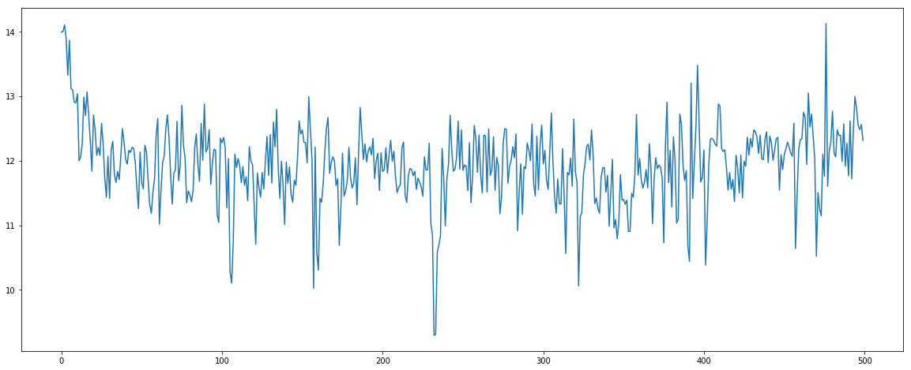


```python
print(rawdata[kpi_list][:500].plot(figsize=(20, 8)))
```

    AxesSubplot(0.125,0.125;0.775x0.755)


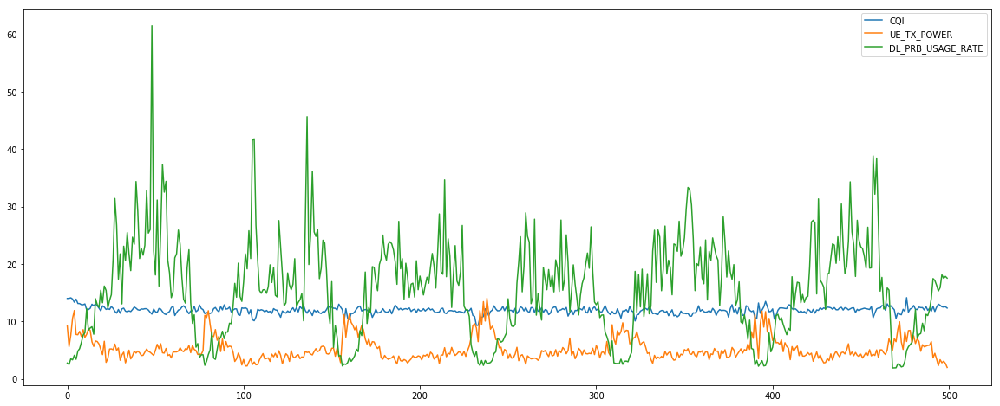


### Scaling


```python
kpi_range_dict = {
    'CQI': [0, 15],
    'UE_TX_POWER': [-17, 23],
    'DL_PRB_USAGE_RATE': [0, 100],
}

data_scaled, scaler_dict = column_range_scaler(
    rawdata[kpi_list],
    vendor_name='SS',
    col_real_range_dict=kpi_range_dict,
    feature_range=(0., 1.),
)
```


```python
print(data_scaled[:500].plot(figsize=(20, 8)))
```

    AxesSubplot(0.125,0.125;0.775x0.755)


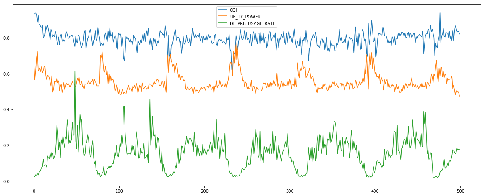


```python
data_scaled.head()
```


<div>
<style scoped>
    .dataframe tbody tr th:only-of-type {
        vertical-align: middle;
    }

    .dataframe tbody tr th {
        vertical-align: top;
    }

    .dataframe thead th {
        text-align: right;
    }
</style>
<table border="1" class="dataframe">
  <thead>
    <tr style="text-align: right;">
      <th></th>
      <th>CQI</th>
      <th>UE_TX_POWER</th>
      <th>DL_PRB_USAGE_RATE</th>
    </tr>
  </thead>
  <tbody>
    <tr>
      <th>0</th>
      <td>0.932667</td>
      <td>0.654567</td>
      <td>0.027383</td>
    </tr>
    <tr>
      <th>1</th>
      <td>0.933222</td>
      <td>0.564936</td>
      <td>0.024817</td>
    </tr>
    <tr>
      <th>2</th>
      <td>0.940000</td>
      <td>0.615000</td>
      <td>0.034750</td>
    </tr>
    <tr>
      <th>3</th>
      <td>0.925444</td>
      <td>0.688750</td>
      <td>0.032917</td>
    </tr>
    <tr>
      <th>4</th>
      <td>0.888222</td>
      <td>0.722361</td>
      <td>0.040917</td>
    </tr>
  </tbody>
</table>
</div>


### Sliding Window (`MLP`)

우선 무슨 데이터를 어떻게 예측할 것인지 정해야 한다.

`X`와 `Y`를 어떻게 정하면 좋을까?
우리가 가진 데이터는 `Time` 축과, `KPI` 축이 있다.


| Case | 기준 | `Time`수 | `KPI`수 | 내용 |
| :--: | :------: | :------: | :----: | :-- |
| 1 | Row | Multi | 1 | 여러 시점의 KPI로 다음 KPI 예측하기 (1 KPI) |
| 2 | Column | 1 | Multi | 한 시점에 대한 KPI 여러 개로 다음 KPI 예측하기 |
| 3 | Row & Column | Multi | Multi | 여러 시점의 KPI로 다음 KPI 예측하기 (3 KPI) |


일단, 축별로 기준을 잡아 보자.


<br>
<font size='4'> <b> $\cdot$ Case 1:</b> 여러 시점의 KPI로 다음 KPI 예측하기 (1 KPI)</font>
<br>
<br>


<br>
<font size='4'> <b> $\cdot$ Case 2:</b> 한 시점의 KPI 여러 개로 다음 KPI 예측하기</font>
<br>
<br>


<br>
<br>
이 중 Case 2에 대해 실습한다. (Case 1을 적용하는 경우, Case 2를 축만 바꾸면 쉽게 응용할 수 있다.)
<br>

<br>
<font size='4'> <b> $\cdot$ 데이터 구조</b></font>
<br>


[Link to MLP Model](#(실습)-MLP-in-keras)

#### Exercise 1 : Basic


```python
from ipywidgets import interact, interactive, fixed, interact_manual, interactive_output
import ipywidgets as widgets
from IPython.display import display
from pprint import pprint
```


```python
#==== Essential ========================================================#

case_x_list = []
case_y_list = []
for i in range(5):
    case_x_list += [data_scaled.iloc[i:i+1, :3]]
    case_y_list += [data_scaled.iloc[i+1:i+2, :2]]

#=======================================================================#


print('\nX', '=' * 45)
pprint(case_x_list)
print('\nY', '=' * 45)
pprint(case_y_list)
```

    
    X =============================================
    [        CQI  UE_TX_POWER  DL_PRB_USAGE_RATE
    0  0.932667     0.654567           0.027383,
             CQI  UE_TX_POWER  DL_PRB_USAGE_RATE
    1  0.933222     0.564936           0.024817,
         CQI  UE_TX_POWER  DL_PRB_USAGE_RATE
    2  0.94        0.615            0.03475,
             CQI  UE_TX_POWER  DL_PRB_USAGE_RATE
    3  0.925444      0.68875           0.032917,
             CQI  UE_TX_POWER  DL_PRB_USAGE_RATE
    4  0.888222     0.722361           0.040917]
    
    Y =============================================
    [        CQI  UE_TX_POWER
    1  0.933222     0.564936,
         CQI  UE_TX_POWER
    2  0.94        0.615,
             CQI  UE_TX_POWER
    3  0.925444      0.68875,
             CQI  UE_TX_POWER
    4  0.888222     0.722361,
             CQI  UE_TX_POWER
    5  0.924222     0.617696]


#### Exercise 2 : Sliding Window


```python
@interact(
    case_num=widgets.IntSlider(min=1, max=10, step=1, value=2),
    kpi_num=widgets.IntSlider(min=1, max=3, step=1, value=3),
)
def shape_print(case_num, kpi_num):

    data_cnt = case_num
    input_dim = kpi_num

    print(
        '=' * 40 +
        '\n (data_cnt, input_dim)  ' +
        ':' +
        f'  ({data_cnt}, {input_dim})\n' +
        '=' * 40 + 
        '\n',
    )

    
    #==== Essential ========================================================#
    
    case_list = []
    for i in range(data_cnt):
        case_list += [(
            'X ' +  '=' * 40,
            data_scaled.iloc[i:i+1, :input_dim],
        )]

    #=======================================================================#

    
    pprint(case_list)
```


    interactive(children=(IntSlider(value=2, description='case_num', max=10, min=1), IntSlider(value=3, descriptio…


#### Exercise 3 : Sliding Window `(X & Y)`


```python
@interact(
    case_num=widgets.IntSlider(min=1, max=10, step=1, value=5),
    x_kpi_num=widgets.IntSlider(min=1, max=3, step=1, value=3),
    y_kpi_num=widgets.IntSlider(min=1, max=3, step=1, value=2),
)
def shape_print(case_num, x_kpi_num, y_kpi_num):

    data_cnt = case_num
    input_dim = x_kpi_num
    output_dim = y_kpi_num

    print(
        '=' * 45 +
        '\n [X]: (data_cnt, input_dim )  ' +
        ':' +
        f'  ({data_cnt}, {input_dim})' +
        '\n [Y]: (data_cnt, output_dim)  ' +
        ':' +
        f'  ({data_cnt}, {output_dim})\n' +
        '=' * 45 + 
        '\n',
    )
    
    
    #==== Essential ========================================================#

    case_list = []
    for i in range(data_cnt):
        case_list += [(
            'X ' +  '=' * 40,
            data_scaled.iloc[i:i+1, :input_dim],
            'Y ' +  '-' * 40,
            data_scaled.iloc[i+1:i+2, :output_dim],
        )]
    
    #=======================================================================#
    
 
    pprint(case_list)
```


    interactive(children=(IntSlider(value=5, description='case_num', max=10, min=1), IntSlider(value=3, descriptio…


```python
def sliding_window_mlp(data, data_cnt, input_dim, output_dim):

    case_x_list = []
    case_y_list = []
    
    data_rownum = data.shape[0]
    max_data_cnt = data_rownum - 1
    
    if data_cnt is None:
        data_cnt = max_data_cnt
    else:
        data_cnt = min(data_cnt, max_data_cnt)
    
    
    #==== Essential ========================================================#
    
    for i in range(data_cnt):
        case_x_list += [data_scaled.iloc[i, :input_dim].values]
        case_y_list += [data_scaled.iloc[i+1, :output_dim].values]

    #=======================================================================#


    print(
        '=' * 45 +
        '\n [X]: (data_cnt, input_dim )  ' +
        ':' +
        f'  ({data_cnt}, {input_dim})' +
        '\n [Y]: (data_cnt, output_dim)  ' +
        ':' +
        f'  ({data_cnt}, {output_dim})\n' +
        '=' * 45 + 
        '\n',
    )
        
    return np.stack(case_x_list), np.stack(case_y_list)


#==== Essential ========================================================#

data_x_mlp, data_y_mlp = sliding_window_mlp(
    data_scaled,
    data_cnt=data_scaled.shape[0],
    input_dim=3,
    output_dim=2,
)

#=======================================================================#


aprint(data_x_mlp[:5], data_y_mlp[:5], name_list=['data_x_mlp[:5]', 'data_y_mlp[:5]'])
```

    =============================================
     [X]: (data_cnt, input_dim )  :  (4289, 3)
     [Y]: (data_cnt, output_dim)  :  (4289, 2)
    =============================================
    
    =========================================================================
    |  data_x_mlp[:5]                        |   data_y_mlp[:5]             |
    |  (5, 3)                                |   (5, 2)                     |
    =========================================================================
    |  [[0.93266667 0.65456731 0.02738333]   |   [[0.93322222 0.5649359 ]   |
    |   [0.93322222 0.5649359  0.02481667]   |    [0.94       0.615     ]   |
    |   [0.94       0.615      0.03475   ]   |    [0.92544444 0.68875   ]   |
    |   [0.92544444 0.68875    0.03291667]   |    [0.88822222 0.72236111]   |
    |   [0.88822222 0.72236111 0.04091667]]  |    [0.92422222 0.61769608]]  |
    =========================================================================


### Sliding Window (`RNN`)

이번에는 `Time`축과 `KPI` 축을 모두 고려해 보자.

<br>
<font size='4'> <b> $\cdot$ Case 3:</b> 여러 시점의 KPI로 다음 KPI 예측하기 (3 KPI)</font>
<br>
<br>


<br>

<br>
<font size='4'> <b> $\cdot$ 데이터 구조</b></font>
<br>


[Link to RNN Model](#(실습)-RNN-in-keras:-many-to-many)

#### Exercise 1 : Basic


```python
case_list = []
for i in range(4):
    case_list += [data_scaled[i:i+7]]

case_list
```


    [        CQI  UE_TX_POWER  DL_PRB_USAGE_RATE
     0  0.932667     0.654567           0.027383
     1  0.933222     0.564936           0.024817
     2  0.940000     0.615000           0.034750
     3  0.925444     0.688750           0.032917
     4  0.888222     0.722361           0.040917
     5  0.924222     0.617696           0.033933
     6  0.874333     0.616587           0.048067,
             CQI  UE_TX_POWER  DL_PRB_USAGE_RATE
     1  0.933222     0.564936           0.024817
     2  0.940000     0.615000           0.034750
     3  0.925444     0.688750           0.032917
     4  0.888222     0.722361           0.040917
     5  0.924222     0.617696           0.033933
     6  0.874333     0.616587           0.048067
     7  0.873000     0.631360           0.052433,
             CQI  UE_TX_POWER  DL_PRB_USAGE_RATE
     2  0.940000     0.615000           0.034750
     3  0.925444     0.688750           0.032917
     4  0.888222     0.722361           0.040917
     5  0.924222     0.617696           0.033933
     6  0.874333     0.616587           0.048067
     7  0.873000     0.631360           0.052433
     8  0.860333     0.609181           0.063267,
             CQI  UE_TX_POWER  DL_PRB_USAGE_RATE
     3  0.925444     0.688750           0.032917
     4  0.888222     0.722361           0.040917
     5  0.924222     0.617696           0.033933
     6  0.874333     0.616587           0.048067
     7  0.873000     0.631360           0.052433
     8  0.860333     0.609181           0.063267
     9  0.859556     0.638884           0.076100]


#### Exercise 2 : Sliding Window


```python
from ipywidgets import interact, interactive, fixed, interact_manual, interactive_output
import ipywidgets as widgets
from IPython.display import display
from pprint import pprint
```


```python
@interact(
    case_num=widgets.IntSlider(min=1, max=10, step=1, value=2),
    window_size=widgets.IntSlider(min=2, max=10, step=1, value=7),
    kpi_num=widgets.IntSlider(min=1, max=3, step=1, value=3),
)
def shape_print(case_num, window_size, kpi_num):

    data_cnt = case_num
    input_size = window_size
    input_dim = kpi_num

    print(
        '=' * 51 +
        '\n (data_cnt, input_size, input_dim)  ' +
        ':' +
        f'  ({data_cnt}, {input_size}, {input_dim})\n' +
        '=' * 51 + 
        '\n',
    )

    
    #==== Essential ========================================================#

    case_list = []
    for i in range(data_cnt):
        case_list += [(
            'X ' +  '=' * 40,
            data_scaled.iloc[i:i+input_size, :input_dim],
        )]

    #=======================================================================#


    pprint(case_list)
```


    interactive(children=(IntSlider(value=2, description='case_num', max=10, min=1), IntSlider(value=7, descriptio…


#### Exercise 3 : Sliding Window `(X & Y)`


```python
!jupyter nbextension enable --py widgetsnbextension
```

    Enabling notebook extension jupyter-js-widgets/extension...
          - Validating: OK


```python
@interact(
    case_num=widgets.IntSlider(min=1, max=10, step=1, value=2),
    window_x=widgets.IntSlider(min=2, max=5, step=1, value=5),
    window_y=widgets.IntSlider(min=1, max=5, step=1, value=2),
    input_kpi_num=widgets.IntSlider(min=1, max=3, step=1, value=3),
    output_kpi_num=widgets.IntSlider(min=1, max=3, step=1, value=3),
)
def shape_print(case_num, window_x, window_y, input_kpi_num, output_kpi_num):

    data_cnt = case_num
    input_size = window_x
    output_size = window_y
    window_size = input_size + output_size
    input_dim = input_kpi_num
    output_dim = output_kpi_num

    print(
        '=' * 60 +
        '\n [X]: (data_cnt, input_size,  input_dim )  ' +
        ':' +
        f'  ({data_cnt}, {input_size}, {input_dim})' +
        '\n [Y]: (data_cnt, output_size, output_dim)  ' +
        ':' +
        f'  ({data_cnt}, {output_size}, {output_dim})\n' +
        '=' * 60 + 
        '\n',
    )
    
    #==== Essential ========================================================#

    case_list = []
    for i in range(data_cnt):
        case_list += [(
            'X ' +  '=' * 40,
            data_scaled.iloc[i:i+input_size, :input_dim],
            'Y ' +  '-' * 40,
            data_scaled.iloc[i+input_size:i+input_size+output_size, :output_dim],
        )]
 
    #=======================================================================#
    

    pprint(case_list)
```


    interactive(children=(IntSlider(value=2, description='case_num', max=10, min=1), IntSlider(value=5, descriptio…


```python
def sliding_window_rnn(data, data_cnt, input_size, output_size, input_dim, output_dim):

    case_x_list = []
    case_y_list = []
    
    data_rownum = data.shape[0]
    max_data_cnt = data_rownum - (input_size + output_size) + 1
    
    if data_cnt is None:
        data_cnt = max_data_cnt
    else:
        data_cnt = min(data_cnt, max_data_cnt)
    
    
    #==== Essential ========================================================#
    
    for i in range(data_cnt):
        case_x_list += [data_scaled.iloc[i:i+input_size, :input_dim].values]
        case_y_list += [data_scaled.iloc[i+input_size:i+input_size+output_size, :output_dim].values]

    #=======================================================================#


    print(
        '=' * 60 +
        '\n [X]: (data_cnt, input_size,  input_dim )  ' +
        ':' +
        f'  ({data_cnt}, {input_size}, {input_dim})' +
        '\n [Y]: (data_cnt, output_size, output_dim)  ' +
        ':' +
        f'  ({data_cnt}, {output_size}, {output_dim})\n' +
        '=' * 60 + 
        '\n',
    )
        
    return np.stack(case_x_list), np.stack(case_y_list)


#==== Essential ========================================================#

data_x_rnn, data_y_rnn = sliding_window_rnn(
    data_scaled,
    data_cnt=data_scaled.shape[0],
    input_size=5,
    output_size=2,
    input_dim=3,
    output_dim=2,
)

#=======================================================================#


aprint(data_x_rnn[:5], data_y_rnn[:5], name_list=['data_x_rnn[:5]', 'data_y_rnn[:5]'])
```

    ============================================================
     [X]: (data_cnt, input_size,  input_dim )  :  (4284, 5, 3)
     [Y]: (data_cnt, output_size, output_dim)  :  (4284, 2, 2)
    ============================================================
    
    =============================================================================
    |  data_x_rnn[:5]                          |   data_y_rnn[:5]               |
    |  (5, 5, 3)                               |   (5, 2, 2)                    |
    =============================================================================
    |  [[[0.93266667 0.65456731 0.02738333]    |   [[[0.92422222 0.61769608]    |
    |    [0.93322222 0.5649359  0.02481667]    |     [0.87433333 0.61658654]]   |
    |    [0.94       0.615      0.03475   ]    |                                |
    |    [0.92544444 0.68875    0.03291667]    |    [[0.87433333 0.61658654]    |
    |    [0.88822222 0.72236111 0.04091667]]   |     [0.873      0.63135965]]   |
    |                                          |                                |
    |   [[0.93322222 0.5649359  0.02481667]    |    [[0.873      0.63135965]    |
    |    [0.94       0.615      0.03475   ]    |     [0.86033333 0.60918103]]   |
    |    [0.92544444 0.68875    0.03291667]    |                                |
    |    [0.88822222 0.72236111 0.04091667]    |    [[0.86033333 0.60918103]    |
    |    [0.92422222 0.61769608 0.03393333]]   |     [0.85955556 0.63888393]]   |
    |                                          |                                |
    |   [[0.94       0.615      0.03475   ]    |    [[0.85955556 0.63888393]    |
    |    [0.92544444 0.68875    0.03291667]    |     [0.869      0.6052193 ]]]  |
    |    [0.88822222 0.72236111 0.04091667]    |                                |
    |    [0.92422222 0.61769608 0.03393333]    |                                |
    |    [0.87433333 0.61658654 0.04806667]]   |                                |
    |                                          |                                |
    |   [[0.92544444 0.68875    0.03291667]    |                                |
    |    [0.88822222 0.72236111 0.04091667]    |                                |
    |    [0.92422222 0.61769608 0.03393333]    |                                |
    |    [0.87433333 0.61658654 0.04806667]    |                                |
    |    [0.873      0.63135965 0.05243333]]   |                                |
    |                                          |                                |
    |   [[0.88822222 0.72236111 0.04091667]    |                                |
    |    [0.92422222 0.61769608 0.03393333]    |                                |
    |    [0.87433333 0.61658654 0.04806667]    |                                |
    |    [0.873      0.63135965 0.05243333]    |                                |
    |    [0.86033333 0.60918103 0.06326667]]]  |                                |
    =============================================================================


### Splitting data : Train & Test


```python
train_x_mlp, test_x_mlp = data_x_mlp[:4000], data_x_mlp[4000:]
train_y_mlp, test_y_mlp = data_y_mlp[:4000], data_y_mlp[4000:]


train_x_rnn, test_x_rnn = data_x_rnn[:4000], data_x_rnn[4000:]
train_y_rnn, test_y_rnn = data_y_rnn[:4000], data_y_rnn[4000:]
```

* Saving the data


```python
data_list = [
    train_x_mlp,
    train_y_mlp,
    train_x_rnn,
    train_y_rnn,
    test_x_mlp,
    test_y_mlp,
    test_x_rnn,
    test_y_rnn,
]


data_str_list = [
    'train_x_mlp',
    'train_y_mlp',
    'train_x_rnn',
    'train_y_rnn',
    'test_x_mlp',
    'test_y_mlp',
    'test_x_rnn',
    'test_y_rnn',
]


for _, __ in zip(data_list, data_str_list):
    _tmp = _.astype(np.float32)
    print(f'{__:10} : {_tmp.shape}')
    np.save(f'data/{__}.npy', _tmp)
```

    train_x_mlp : (4000, 3)
    train_y_mlp : (4000, 2)
    train_x_rnn : (4000, 5, 3)
    train_y_rnn : (4000, 2, 2)
    test_x_mlp : (289, 3)
    test_y_mlp : (289, 2)
    test_x_rnn : (284, 5, 3)
    test_y_rnn : (284, 2, 2)


* Loading the data


```python
data_dict = load_data()

train_x_mlp = data_dict['train_x_mlp']
train_y_mlp = data_dict['train_y_mlp']
test_x_mlp = data_dict['test_x_mlp']
test_y_mlp = data_dict['test_y_mlp']
```

    Loading Data...
    train_x_mlp : (4000, 3)
    train_y_mlp : (4000, 2)
    train_x_rnn : (4000, 5, 3)
    train_y_rnn : (4000, 2, 2)
    test_x_mlp : (289, 3)
    test_y_mlp : (289, 2)
    test_x_rnn : (284, 5, 3)
    test_y_rnn : (284, 2, 2)
    Complete.


```python
load_data
```


    <function src.load_data.load_data()>


## (실습) MLP in `keras`

<br>
<font size='4'> <b> $\cdot$ Case 2:</b> 한 시점의 KPI 여러 개로 다음 KPI 예측하기</font>
<br>
<br>


<br>
<font size='4'> <b> $\cdot$ 계산 흐름 : MLP</b></font>


<br>
<font size='4'> <b> $\cdot$ 코드 리뷰 : MLP</b></font>
<br>

[Link to MLP Input](#Sliding-Window-(MLP))

<div class="alert alert-block alert-info">
<b>$\divideontimes$ Unit_num 이란 : </b> 

딥러닝 Framework에서 흔히 볼 수 있는 `unit_num`은 `output_shape`를 말한다.


뇌와 뉴런(뇌신경)을 생각해 보자.  
우리가 영화를 볼 때, 뇌에서 어떤 뉴런은 영상 이미지를, 어떤 뉴런은 소리를 받아들인다.  
하나의 화면은 수많은 뉴런들을 통해 각각의 결과를 내놓게 되고  
최종적으로는 이 결과들을 종합하여 영화가 재미있는지 판단한다.  

`unit_num`은 입력을 처리하는 뉴런의 개수이며  
한 화면에 대해 뉴런의 개수만큼 결과가 나오는 것 처럼,  
Input을 바라보는 `unit`의 개수만큼 Hidden Dimension의 크기도 커지게 된다.  


<br>
<br>
<font size='5'><center><b><i>"`unit_num`으로 다음 번 `Hidden Dimension`의 크기를 결정한다."</i></b></center></font>
<br>
<br>
<br>
$\cdot$ <font size='3'>Input Dimension : $m = 3$</font><br>

$\cdot$ <font size='3'>Output Dimension : $l = 4$</font>  


<font size='4'>
\begin{equation}
\begin{bmatrix} n\times m \end{bmatrix}
\overbrace{ \begin{bmatrix} m\times l \end{bmatrix} }^{Layer} 
= \begin{bmatrix} n\times l \end{bmatrix}
\end{equation}
</font>

$\space$
$\space$

<font size='4'>
\begin{equation}
\overbrace{
\left({\begin{array}{cc}
\color{red}a & \color{red}b & \color{red}c \\
\color{red}d & \color{red}e & \color{red}f 
\end{array}}\right)
}^{input \_ dim \space = \space 3}
\overbrace{
\left( \begin{array}{cc}
    \color{blue}  A & \color{blue} D & \color{blue} G & \color{blue} J \\
    \color{blue} B & \color{blue} E & \color{blue} H & \color{blue} K \\
    \color{blue} C & \color{blue} F & \color{blue} I & \color{blue} L \\
\end{array} \right) }^{unit \_ num \space = \space 4}
= \overbrace{
\left(\begin{array}{cc} 
    \color{red}a \color{blue}A + \color{red}b \color{blue}B + \color{red}c \color{blue}C & 
    \color{red}a \color{blue}D + \color{red}b \color{blue}E + \color{red}c \color{blue}F &
    \color{red}a \color{blue}G + \color{red}b \color{blue}H + \color{red}c \color{blue}I &
    \color{red}a \color{blue}J + \color{red}b \color{blue}K + \color{red}c \color{blue}L
    \\
    \color{red}d \color{blue}A + \color{red}e \color{blue}B + \color{red}f \color{blue}C & 
    \color{red}d \color{blue}D + \color{red}e \color{blue}E + \color{red}f \color{blue}F & 
    \color{red}d \color{blue}G + \color{red}e \color{blue}H + \color{red}f \color{blue}I &
    \color{red}d \color{blue}J + \color{red}e \color{blue}K + \color{red}f \color{blue}L
    \\
\end{array}\right)
}^{output \_ dim \space = \space unit \_ num \space = \space 4}
\end{equation}
</font>

</div>
<br>


```python
import keras
import keras.backend as K
from keras import Model, Sequential
from keras.layers import Input, Dense, SimpleRNN, LSTM, GRU, TimeDistributed
```

    Using TensorFlow backend.


### MLP Modeling


```python
input_layer = Input(shape=(3, ))
layer1 = Dense(4, input_dim=3, activation='sigmoid')
layer2 = Dense(2, input_dim=4, activation='sigmoid')

hidden_layer1 = layer1(input_layer)
output_layer = layer2(hidden_layer1)

model = Model(inputs=[input_layer], outputs=[output_layer])

model.summary()
```

    _________________________________________________________________
    Layer (type)                 Output Shape              Param #   
    =================================================================
    input_1 (InputLayer)         (None, 3)                 0         
    _________________________________________________________________
    dense_1 (Dense)              (None, 4)                 16        
    _________________________________________________________________
    dense_2 (Dense)              (None, 2)                 10        
    =================================================================
    Total params: 26
    Trainable params: 26
    Non-trainable params: 0
    _________________________________________________________________


```python
input_layer = Input(shape=(3, ))
layer1 = Dense(16, input_dim=3, activation='sigmoid')
layer2 = Dense(64, input_dim=16, activation='sigmoid')
layer3 = Dense(16, input_dim=64, activation='sigmoid')
layer4 = Dense(8, input_dim=16, activation='sigmoid')
layer5 = Dense(2, input_dim=8, activation='sigmoid')

hidden_layer1 = layer1(input_layer)
hidden_layer2 = layer2(hidden_layer1)
hidden_layer3 = layer3(hidden_layer2)
hidden_layer4 = layer4(hidden_layer3)
output_layer = layer5(hidden_layer4)

model = Model(inputs=[input_layer], outputs=[output_layer])

model.summary()
```

    _________________________________________________________________
    Layer (type)                 Output Shape              Param #   
    =================================================================
    input_4 (InputLayer)         (None, 3)                 0         
    _________________________________________________________________
    dense_13 (Dense)             (None, 16)                64        
    _________________________________________________________________
    dense_14 (Dense)             (None, 64)                1088      
    _________________________________________________________________
    dense_15 (Dense)             (None, 16)                1040      
    _________________________________________________________________
    dense_16 (Dense)             (None, 8)                 136       
    _________________________________________________________________
    dense_17 (Dense)             (None, 2)                 18        
    =================================================================
    Total params: 2,346
    Trainable params: 2,346
    Non-trainable params: 0
    _________________________________________________________________


### MLP Building

* `optimizer` : 복습 노하우
* `loss` : 모의고사 때 사용할 점수계산법 (`총점`, `평균`)
* `metrics` : 실전에서 사용할 점수계산법 (`1 ~ 7등급`, `A ~ F`, `수우미양가`)


```python
model.compile(optimizer='adam', loss='mean_squared_error', metrics=['mae'])
```

### MLP Training

<div class="alert alert-block alert-success">
<b>Q.</b> 모델을 학습시켜 보자.
<n>

<b><i>`batch_size`</i></b>와 <b><i>`epoch`</i></b>를 조절해 보고,
`loss` 값이 줄어들고 있는 지 Plot으로 확인해 보자.
</div>


```python
fitted = model.fit(
    train_x_mlp,
    train_y_mlp,
    batch_size=64,
    epochs=200,
    validation_split=.2,
    verbose=1,            # [verbose] 1: progress bar, 2: one line per epoch
    shuffle=True,
)
```

    Train on 3200 samples, validate on 800 samples
    Epoch 1/200
    3200/3200 [==============================] - 0s 50us/step - loss: 0.0017 - mean_absolute_error: 0.0294 - val_loss: 0.0029 - val_mean_absolute_error: 0.0438
    Epoch 2/200
    3200/3200 [==============================] - 0s 44us/step - loss: 0.0017 - mean_absolute_error: 0.0295 - val_loss: 0.0029 - val_mean_absolute_error: 0.0441
    Epoch 3/200
    3200/3200 [==============================] - 0s 46us/step - loss: 0.0017 - mean_absolute_error: 0.0294 - val_loss: 0.0027 - val_mean_absolute_error: 0.0423
    Epoch 4/200
    3200/3200 [==============================] - 0s 41us/step - loss: 0.0017 - mean_absolute_error: 0.0294 - val_loss: 0.0028 - val_mean_absolute_error: 0.0423
    Epoch 5/200
    3200/3200 [==============================] - 0s 41us/step - loss: 0.0017 - mean_absolute_error: 0.0294 - val_loss: 0.0027 - val_mean_absolute_error: 0.0415
    Epoch 6/200
    3200/3200 [==============================] - 0s 41us/step - loss: 0.0017 - mean_absolute_error: 0.0295 - val_loss: 0.0028 - val_mean_absolute_error: 0.0427
    Epoch 7/200
    3200/3200 [==============================] - 0s 41us/step - loss: 0.0017 - mean_absolute_error: 0.0294 - val_loss: 0.0027 - val_mean_absolute_error: 0.0415
    Epoch 8/200
    3200/3200 [==============================] - 0s 45us/step - loss: 0.0017 - mean_absolute_error: 0.0294 - val_loss: 0.0029 - val_mean_absolute_error: 0.0436
    Epoch 9/200
    3200/3200 [==============================] - 0s 44us/step - loss: 0.0017 - mean_absolute_error: 0.0294 - val_loss: 0.0030 - val_mean_absolute_error: 0.0450
    Epoch 10/200
    3200/3200 [==============================] - 0s 43us/step - loss: 0.0017 - mean_absolute_error: 0.0294 - val_loss: 0.0028 - val_mean_absolute_error: 0.0422
    Epoch 11/200
    3200/3200 [==============================] - 0s 44us/step - loss: 0.0017 - mean_absolute_error: 0.0294 - val_loss: 0.0028 - val_mean_absolute_error: 0.0418
    Epoch 12/200
    3200/3200 [==============================] - 0s 45us/step - loss: 0.0017 - mean_absolute_error: 0.0294 - val_loss: 0.0027 - val_mean_absolute_error: 0.0413
    Epoch 13/200
    3200/3200 [==============================] - 0s 46us/step - loss: 0.0017 - mean_absolute_error: 0.0295 - val_loss: 0.0028 - val_mean_absolute_error: 0.0420
    Epoch 14/200
      64/3200 [..............................] - ETA: 0s - loss: 0.0017 - mean_absolute_error: 0.03


<b>limit_output extension: Maximum message size of 10000 exceeded with 10159 characters</b>


```python
keras_lossplot(model)
```


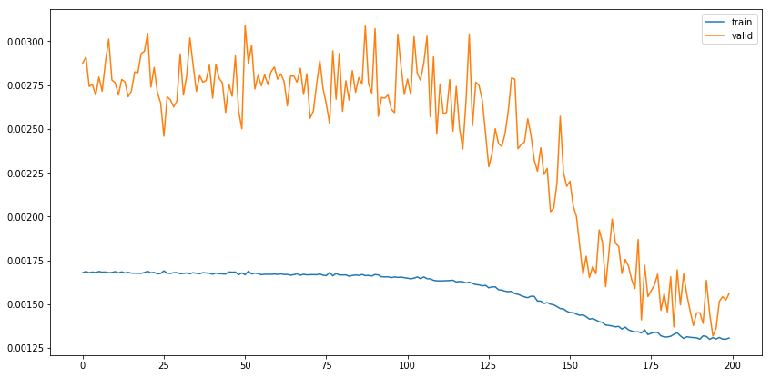


<div class="alert alert-block alert-danger">
<b>Tip:</b>  
<n>

`batch_size`가 너무 커도 학습이 잘 되지 않으며, 무작정 `epoch` 수로 반복을 많이 시켜도 학습성능에 큰 도움이 되지 않는다.
<n>

`batch_size`를 작게 하면 어떨까?
</div>

<br>우리가 한국사 시험을 본다고 가정하자.


* `batch_size` : 모의고사 1회분 출제 범위(8=고조선~삼국시대, 256=고조선~근현대사)
* `epoch` : 모의고사 응시 횟수
* `shuffle` : 문항/보기 섞기
* 모델의 깊이(`layer`의 개수, `hidden space`의 크기) : 학업수준, IQ


학생의 학업수준에 따라 각 항목들을 적절히 배분해야 실력이 쑥쑥 늘듯이,   
<font size='4'><font color='#318CE7'><b><i>모델의 구조를 고려하여 적절한 Parameter 값을 지정해 주어야 한다.</i></b></font></font>

<br>
</div>  

### MLP Evaluation

위에서는 모의고사 점수로 학습의 진행상황만을 확인할 수 있었다.  
이제 실전으로 그동안의 노력에 대한 결과를 평가해 보자.

<br>
<br>
<font size='5'><center><b><i>"Training set으로 학습한 모델을 Test set으로 평가한다."</i></b></center></font>
<br><n>

`model.compile`에서 설정한 `loss`와 `metrics` 값이 각각 출력된다.


|  항목      |  내용                   |  예시        |
|:----------|-----------------------:|:------------|
|  `loss`   | 학습할 때 사용한 점수계산법   | 수능점수(총점) |
| `metrics` | 평가할 때 사용하는 점수계산법 |  수능 등급제   |
<br>

Result: 
```
<finished>/<total test num> [====== <progress bar> ========] - <elapsed time>/step
[<loss>, <metrics>]
```


```python
model.evaluate(test_x_mlp, test_y_mlp)
```

    289/289 [==============================] - 0s 34us/step


    [0.001410347225859916, 0.030117209498032566]


### MLP Prediction

이제 학습도 했고, 실전평가도 치뤘다.  
하지만 수능을 잘 푸는 것과 일을 잘 하는 건 다른 이야기이다. 진정한 의미의 실전에 투입해 보자.

*__X__* Case 1개를 골라 *__Y__*값을 예측해 보자.

<div class="alert alert-block alert-danger">
<b>Tip:</b>  
<n>


```py
model.predict(test_x_mlp[0])
```

위의 코드는 돌아가지 않는다. 왜일까?
<n>

```
ValueError: Error when checking input: expected input_2 to have shape (3,) but got array with shape (1,)
```

그동안 사용했던 Input은 `(N, 3)` 형태의 2차원 array였다.  
1개만 선택해 버리니 `N`에 해당하는 차원을 생략하고 `3`만 남은 것이다.  
2차원을 유지하면서 1개만 선택하려면 어떻게 넣어야 할까?

</div>


```python
model.predict(test_x_mlp[:1])
```


    array([[0.8122951 , 0.63150454]], dtype=float32)


실제 나와야 하는 값은:


```python
test_y_mlp[:1]
```


    array([[0.8277778, 0.6791667]], dtype=float32)


```python
keras_predict_plot(model, test_x_mlp, test_y_mlp, method='mlp')
```

    /opt/conda/envs/tf-py36/lib/python3.6/site-packages/matplotlib/figure.py:457: UserWarning: matplotlib is currently using a non-GUI backend, so cannot show the figure
      "matplotlib is currently using a non-GUI backend, "


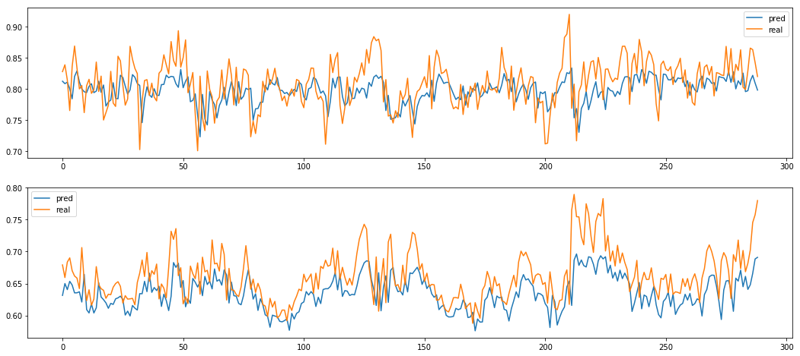


## (개념) MLP: Multi Layer Perceptron

<br>
이제 Layer를 행렬로 표현해 보자.  

$\space$
<center><font size='4'><b>복잡해 보여도 단지 행렬연산의 응용일 뿐!</b></font></center>
    
$\space$
\begin{equation}
\overbrace{ \begin{bmatrix} \color{red}3 \end{bmatrix} }^{INPUT}
\overbrace{ \begin{bmatrix} \color{red}3 \times \color{blue}4 \end{bmatrix} }^{1st \space Layer} 
\overbrace{ \begin{bmatrix} \color{blue}4 \times 2 \end{bmatrix} }^{2nd \space Layer} 
= \begin{bmatrix} 2 \end{bmatrix}
\end{equation}
$\space$

\begin{equation}
\overbrace{ \begin{bmatrix} Batch \times \color{red}3 \end{bmatrix} }^{INPUT}
\overbrace{ \begin{bmatrix} \color{red}3 \times \color{blue}4 \end{bmatrix} }^{1st \space Layer} 
\overbrace{ \begin{bmatrix} \color{blue}4 \times 2 \end{bmatrix} }^{2nd \space Layer} 
= \begin{bmatrix} Batch \times 2 \end{bmatrix}
\end{equation}  
$\space$
<div class="alert alert-block alert-warning">
<b>$\divideontimes$ 행렬과 사상: </b> $[m \times n]$은 $n$ 차원 공간에서 $m$ 차원 공간으로의 mapping ( $L:N \rightarrow M$ )    
$\space$
$\space$
<font size='5'>$$\underbrace{Y}_{ [m] } = \underbrace{A}_{ [m \times n] } \underbrace{X}_{ [n] }$$  </font>
</div>  

$m$ 차원에서 $n$ 차원으로의 사상은,
<font size='5'>$$\underbrace{Y}_{ [n] } = \underbrace{X}_{ [m] } \underbrace{A}_{ [m \times n] }$$  </font>

<div align="right"><font color='red'><b>* $y=ax$의 순서와 다른 점에 주의.</b></font></div>


### Input

<br>
$m$ 차원에서 $n$ 차원으로의 사상 = 행렬 = Layer의 의미를 알았으니, 
이제는 `Input` $m$ 과 `Output` $n$ 에 대해 알아보자.
<br>
<br>
우리의 첫 Layer <b>$A$</b> 는 한 번에 $\color{red}3$차원의 Data $X$를 소화하는 행렬이다.  
하지만, $[2 \times \color{red}3]$ 처럼 <font color='#318CE7'><b><i>행렬의 형태로 한 번에 병렬처리 할 수도 있다.</i></b></font></font>

이 때의 Data 개수는 `Output` 까지 유지된다.

$\space$
\begin{equation}
\overbrace{ \begin{bmatrix} Batch \times \color{red}3 \end{bmatrix} }^{INPUT}
\begin{bmatrix} \color{red}3 \times \color{blue}4 \end{bmatrix}
\begin{bmatrix} \color{blue}4 \times 2 \end{bmatrix}
= \overbrace{ \begin{bmatrix} Batch \times 2 \end{bmatrix} }^{OUTPUT}
\end{equation}  
$\space$


<font size='5'>$$\underbrace{Y}_{ [B \times \color{blue}n] } = \underbrace{X}_{ [B \times \color{red}m] } \underbrace{A}_{ [\color{red}m \times \color{blue}n] }$$  </font>

<br>
<font size='3'>이제 우리는 열벡터 1개씩을 처리하는 것이 아니라, <font color='#318CE7'><b><i>Batch로 여러 Input을 한 번에 처리할 수 있다</i></b></font></font>

<div class="alert alert-block alert-warning">
<b>$\divideontimes$ Input의 형태: </b> $[2 \times 3]$은 $3$차원으로 이루어진 데이터 $2$개를 의미한다.
<br>
<br>
<font size='5'>$$[2 \times 3]=[Data \space 개수, Data \space 차원]$$  </font>

</div>  


```python
arr_x = train_x_mlp[:2].round(2)
arr_x1 = train_x_mlp[:1].round(2)

aprint(arr_x, arr_x1, name_list=['arr_x', 'arr_x_one'])
```

    ================================================
    |  arr_x               |   arr_x_one           |
    |  (2, 3)              |   (1, 3)              |
    ================================================
    |  [[0.93 0.65 0.03]   |   [[0.93 0.65 0.03]]  |
    |   [0.93 0.56 0.02]]  |                       |
    ================================================


### Output


```python
arr_y = train_y_mlp[:2].round(2)
arr_y1 = train_y_mlp[:1].round(2)

aprint(arr_y, arr_y1, name_list=['arr_y', 'arr_y_one'])
```

    ======================================
    |  arr_y          |   arr_y_one      |
    |  (2, 2)         |   (1, 2)         |
    ======================================
    |  [[0.93 0.56]   |   [[0.93 0.56]]  |
    |   [0.94 0.62]]  |                  |
    ======================================


### Layers

<br>
이제 Data도 행렬로 표현해 보자.  

첫째 Layer는 $\color{red}3$차원의 Data $X$를 $\color{blue}4$차원으로 확장하고,  
둘째 Layer는 $\color{blue}4$차원을 $\color{black}2$차원으로 축소하게 된다.

$\space$
\begin{equation}
\begin{bmatrix} Batch \times \color{red}3 \end{bmatrix}
\overbrace{ \begin{bmatrix} \color{red}3 \times \color{blue}4 \end{bmatrix} }^{1st \space Layer}
\overbrace{ \begin{bmatrix} \color{blue}4 \times 2 \end{bmatrix} }^{2nd \space Layer}
= \begin{bmatrix} Batch \times 2 \end{bmatrix}
\end{equation}  
$\space$

<font size='5'>$$\underbrace{Y}_{ [B \times \color{blue}n] } = \underbrace{X}_{ [B \times \color{red}m] } \underbrace{A}_{ [\color{red}m \times \color{blue}n] }$$  </font>

<br>
이 기본 Layer의 형태를 `Fully Connected Layer` 또는 `Dense Layer`라고 부른다.  
<b>Layer를 구성하기 위해서는 $\color{red}m$과 $\color{blue}n$을 정해 주어야 한다.</b>  
값을 정하고 나면, 임의의 초기값으로 행렬을 만들어 Layer를 처음 구성하게 된다.

이 때, $\color{blue}n$에 해당하는 $ \color{blue}4$차원을 Hidden Layer의 차원이라고 한다.  
즉 Layer는 <b>$m$ 차원 Input으로 $n$ 차원 Output을 만들어 내는 행렬이라고 할 수 있다.</b>
<font size='3'>이제 우리는, <font color='#318CE7'> <b><i> 점이 아닌 선을 Layer로 볼 수 있다.</i></b></font></font>

<div class="alert alert-block alert-warning">
<b>$\divideontimes$ Layer의 형태: </b> <b>$m$ 차원 Input으로 $n$ 차원 Output을 만들어 내는 행렬</b>

<br>
<br>
<font size='5'>$$[3 \times 4]=[Input \space Data \space 차원, Hidden \space 차원]$$  </font>

</div>  

기본 Layer는 `Fully Connected Layer` 또는 `Dense Layer`이며,
`input`과 `output shape`를 변수로 받아 생성.

* <font size='3'>Input Shape : $m$</font>
* <font size='3'>Output Shape : $l$</font>


<font size='4'>
\begin{equation}
\begin{bmatrix} n\times m \end{bmatrix}
\overbrace{ \begin{bmatrix} m\times l \end{bmatrix} }^{Layer} 
= \begin{bmatrix} n\times l \end{bmatrix}
\end{equation}
</font>

$\space$
$\space$

<font size='4'>
\begin{equation}
\left({\begin{array}{cc} \color{red}a & \color{red}b & \color{red}c\\\color{red}d & \color{red}e & \color{red}f \end{array}}\right)
\overbrace{ \left( \begin{array}{cc} \color{blue}  A & \color{blue} D & \color{blue} G\\ \color{blue} B & \color{blue} E & \color{blue} H \\ \color{blue} C & \color{blue} F & \color{blue} I \end{array} \right) }^{Layer}
= \left(\begin{array}{cc} 
\color{red}a \color{blue}A + \color{red}b \color{blue}B + \color{red}c \color{blue}C & 
\color{red}a \color{blue}D + \color{red}b \color{blue}E + \color{red}c \color{blue}F &
\color{red}a \color{blue}G + \color{red}b \color{blue}H + \color{red}c \color{blue}I
\\
\color{red}d \color{blue}A + \color{red}e \color{blue}B + \color{red}f \color{blue}C & 
\color{red}d \color{blue}D + \color{red}e \color{blue}E + \color{red}f \color{blue}F & 
\color{red}d \color{blue}G + \color{red}e \color{blue}H + \color{red}f \color{blue}I
\\
\end{array}\right)
\end{equation}
</font>

#### Dense Layer (Fully Connected Layer)


```python
def dense_layer(
    input_x,
    output_dim=None,
    name=None,
    seed=1,
    ):
    input_dim = input_x.shape[-1]
    np.random.seed(seed)
    
    
    #==== Essential ========================================================#

    weight = np.random.random((input_dim, output_dim)).round(2)

    output = input_x @ weight
    
    #=======================================================================#
    
    
    print(name)
    aprint(input_x, weight, output, name_list=['Input', 'Weight', 'Output'])

    return output, weight
```


```python
dense_layer(arr_x, output_dim=4)
```

    None
    ==========================================================================================================
    |  Input               |   Weight                   |   Output                                           |
    |  (2, 3)              |   (3, 4)                   |   (2, 4)                                           |
    ==========================================================================================================
    |  [[0.93 0.65 0.03]   |   [[0.42 0.72 0.   0.3 ]   |   [[0.5001     0.7443     0.1361     0.52719999]   |
    |   [0.93 0.56 0.02]]  |    [0.15 0.09 0.19 0.35]   |    [0.4826     0.73080001 0.1148     0.4888    ]]  |
    |                      |    [0.4  0.54 0.42 0.69]]  |                                                    |
    ==========================================================================================================


    (array([[0.5001    , 0.7443    , 0.1361    , 0.52719999],
            [0.4826    , 0.73080001, 0.1148    , 0.4888    ]]),
     array([[0.42, 0.72, 0.  , 0.3 ],
            [0.15, 0.09, 0.19, 0.35],
            [0.4 , 0.54, 0.42, 0.69]]))


#### Initialization

Layer를 생성한다는 것은 행렬을 생성한다는 것과 같다.  
이 때 임의의 값을 이용해 행렬을 생성하여야 하는데, 이 초기값을 부여하는 과정을 `Initialization` 이라고 함.


```python
np.random.seed(1)
np.random.random((3, 4)).round(2)
```


    array([[0.42, 0.72, 0.  , 0.3 ],
           [0.15, 0.09, 0.19, 0.35],
           [0.4 , 0.54, 0.42, 0.69]])


### Activation Function

Layer 간의 선형 결합은 선형 함수(1차 함수)의 형태로만 존재한다.

\begin{equation}
y = f(x) = ax,\\  
z = g(y) = by,\\
 \\
z = g(f(x)) = b(ax) = abx
\end{equation}

$c = ab$ 라고 하면
<font size='4'>$$z = h(x) = cx$$</font>

가 되어 사실상 2개를 겹친 효과가 없어진다.  
그러므로, Layer 사이에 비선형 함수를 끼워 넣어 
$y=f(x)$ 를 비선형 관계로 만들게 된다.  

또한, Output 값의 범위를 $[0, 1]$ 사이로 제한하는 효과도 있다. (`sigmoid`)

#### Activations & Its Derivatives


```python
examples.activation_plot()
```

    /opt/conda/envs/tf-py36/lib/python3.6/site-packages/matplotlib/figure.py:457: UserWarning: matplotlib is currently using a non-GUI backend, so cannot show the figure
      "matplotlib is currently using a non-GUI backend, "


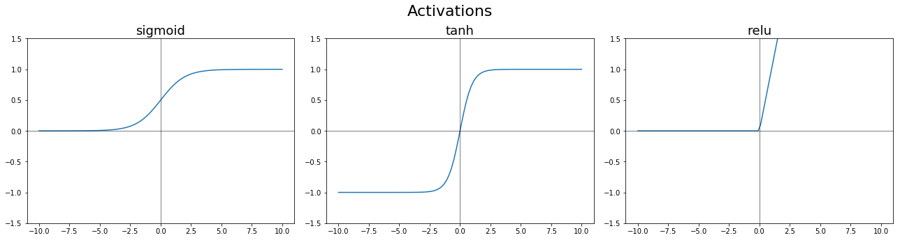


`sigmoid` 함수는 `tanh`에 비해 기울기가 작다.  
미분값의 최대치가 0.25이며, 미분값이 1인 `tanh` 함수에 비해 $\frac {1}{4}$ 수준이다.

<font color='#318CE7'> <b><i> 이 기울기는 $x$값의 차이에 비해 $y$값의 차이가 작다는 말이며, 학습 진도가 느린 원인이 된다.  </i></b></font>

때문에, 미분값이 커서 학습 Impact가 큰 `tanh`나 `relu`가 등장하게 된다.


```python
examples.d_activation_plot()
```

    /opt/conda/envs/tf-py36/lib/python3.6/site-packages/matplotlib/figure.py:457: UserWarning: matplotlib is currently using a non-GUI backend, so cannot show the figure
      "matplotlib is currently using a non-GUI backend, "


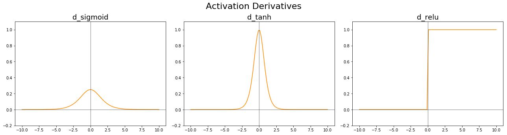


#### Biases

<div class="alert alert-block alert-success">
<b>$\divideontimes$ `bias`가 갖는 의미 </b>  
<n></n>  

`weight`가 $x$ 간의 관계를 설명한다면, `bias`는 영점조절이라고 할 수 있다.  
`bias`가 없으면, $x$의 차원에 관계없이 모든 함수는 원점 <font color="black">$(0, 0)$</font> 을 지나게 되어 데이터 학습에 지장을 초래할 수 있다.
</div>


---
* $y = 2x$


```python
examples.draw_without_bias()
```


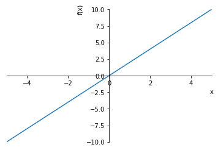


---
* $y=2x-4$


```python
examples.draw_with_bias()
```


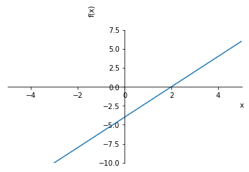


### Complete Network

`Input`과 `Layer`, `Activation`을 활용하여 간단한 `Multi Layer Perceptron` 모델을 생성해 보자.


```python
# Input Layer
input_layer = arr_x1


# Hidden Layer
hidden_layer_1, w1 = dense_layer(
    input_layer,
    output_dim=4,
    seed=4,
    name='fc1_layer',
)
activated_1 = sigmoid(hidden_layer_1)


# Output Layer
hidden_layer_2, w2 = dense_layer(
    hidden_layer_1,
    output_dim=2,
    seed=3,
    name='fc2_layer',
)
activated_2 = sigmoid(hidden_layer_2)
```

    fc1_layer
    ==========================================================================================================
    |  Input               |   Weight                   |   Output                                           |
    |  (1, 3)              |   (3, 4)                   |   (1, 4)                                           |
    ==========================================================================================================
    |  [[0.93 0.65 0.03]]  |   [[0.97 0.55 0.97 0.71]   |   [[1.36459999 0.6674     1.56249998 0.6728    ]]  |
    |                      |    [0.7  0.22 0.98 0.01]   |                                                    |
    |                      |    [0.25 0.43 0.78 0.2 ]]  |                                                    |
    ==========================================================================================================
    sigmoid
    ==========================================================================================================
    |  Raw                                              |   Activated                                        |
    |  (1, 4)                                           |   (1, 4)                                           |
    ==========================================================================================================
    |  [[1.36459999 0.6674     1.56249998 0.6728    ]]  |   [[0.7965063  0.66092073 0.82671179 0.66212984]]  |
    ==========================================================================================================
    fc2_layer
    =======================================================================================================
    |  Input                                            |   Weight         |   Output                     |
    |  (1, 4)                                           |   (4, 2)         |   (1, 2)                     |
    =======================================================================================================
    |  [[1.36459999 0.6674     1.56249998 0.6728    ]]  |   [[0.55 0.71]   |   [[2.42216498 2.85677798]]  |
    |                                                   |    [0.29 0.51]   |                              |
    |                                                   |    [0.89 0.9 ]   |                              |
    |                                                   |    [0.13 0.21]]  |                              |
    =======================================================================================================
    sigmoid
    ==============================================================
    |  Raw                        |   Activated                  |
    |  (1, 2)                     |   (1, 2)                     |
    ==============================================================
    |  [[2.42216498 2.85677798]]  |   [[0.91850195 0.94566799]]  |
    ==============================================================


```python
hidden_layer_2
```


    array([[2.42216498, 2.85677798]])


```python
activated_2
```


    array([[0.91850195, 0.94566799]])


### Batch

<br>
이제 Batch에 대해 알아보자.

<br>
<font size="3">Batch는 한번 학습에 이용하는 샘플 단위를 말한다.</font><br>
<br>
전체 Input의 개수가 10이고 `batch_size`가 2일 경우, $\space\space$<font size='4'><b> $\leftarrow$ input_size: 10, batch_size: 2</b></font><br>
부분집합인 2개씩을 꺼내어 1번 학습에 활용하게 되고 $\space\space$<font size='4'><b> $\leftarrow$ step_num: 1 (누적학습횟수)</b></font><br> 
총 5번 학습하면 전체 Input을 다 학습하게 된다. $\space\space$<font size='4'><b> $\leftarrow$ batch_nu: 5 (학습횟수)</b></font><br>
이렇게 Input을 한번 다 보는 경우를 1 epoch이라 하며, $\space\space$<font size='4'><b> $\leftarrow$ epoch_num: 1</b></font><br>
<br>

<font size="3">10 epoch로 학습하는 경우  
`batch_num`은 5, `step_num`은 50이 된다.</font>

<br>
<br>
$\space$
$\space 1 \space Epoch,$
\begin{equation}
\begin{bmatrix} 1st \space Batch \times \color{red}3 \end{bmatrix}
\overbrace{ \begin{bmatrix} \color{red}3 \times \color{blue}4 \end{bmatrix} }^{1st Layer}
\overbrace{ \begin{bmatrix} \color{blue}4 \times 2 \end{bmatrix} }^{2nd Layer}
= \begin{bmatrix} 1st \space Batch \times 2 \end{bmatrix}
\Rightarrow 1st \space Backpropagation
\end{equation}  
\begin{equation}
\begin{bmatrix} 2nd \space Batch \times \color{red}3 \end{bmatrix}
\overbrace{ \begin{bmatrix} \color{red}3 \times \color{blue}4 \end{bmatrix} }^{1st Layer}
\overbrace{ \begin{bmatrix} \color{blue}4 \times 2 \end{bmatrix} }^{2nd Layer}
= \begin{bmatrix} 2nd \space Batch \times 2 \end{bmatrix}
\Rightarrow 2nd \space Backpropagation
\end{equation}  
$$\vdots$$
\begin{equation}
\begin{bmatrix} 5th \space Batch \times \color{red}3 \end{bmatrix}
\overbrace{ \begin{bmatrix} \color{red}3 \times \color{blue}4 \end{bmatrix} }^{1st Layer}
\overbrace{ \begin{bmatrix} \color{blue}4 \times 2 \end{bmatrix} }^{2nd Layer}
= \begin{bmatrix} 5th \space Batch \times 2 \end{bmatrix}
\Rightarrow 5th \space Backpropagation
\end{equation} 
$\space$

<br>
<br>

학습할 때는 주어진 `input_size`에 대해 `batch_size`와 `epoch_num`을 지정한다.<br>
<font size='3'>이제, <font color='#318CE7'> <b><i> 딥러닝 모델이 Input을 어떻게 읽어들이는 지 알 수 있다.</i></b></font></font>
<br>

<div class="alert alert-block alert-warning">
<b>$\divideontimes$ Batch란:  </b> <b>1번 학습에 활용하는 Input의 부분집합 단위</b>

<br>
<br>
$$Batch \space num = \frac {Input \space size}{Batch \space size}$$  

$$1 \space Epoch = Batch \space size \times Batch \space num$$  

$$ Step \space num = Epoch \space num \times Batch \space num$$  
<br>
</div>  


```python
# Input Layer
input_layer = arr_x1


# Hidden Layer
hidden_layer_1, w1 = dense_layer(
    input_layer,
    output_dim=4,
    seed=4,
    name='fc1_layer',
)
activated_1 = sigmoid(hidden_layer_1)


# Output Layer
hidden_layer_2, w2 = dense_layer(
    hidden_layer_1,
    output_dim=2,
    seed=3,
    name='fc2_layer',
)
activated_2 = sigmoid(hidden_layer_2)
```

    fc1_layer
    ==========================================================================================================
    |  Input               |   Weight                   |   Output                                           |
    |  (1, 3)              |   (3, 4)                   |   (1, 4)                                           |
    ==========================================================================================================
    |  [[0.93 0.65 0.03]]  |   [[0.97 0.55 0.97 0.71]   |   [[1.36459999 0.6674     1.56249998 0.6728    ]]  |
    |                      |    [0.7  0.22 0.98 0.01]   |                                                    |
    |                      |    [0.25 0.43 0.78 0.2 ]]  |                                                    |
    ==========================================================================================================
    sigmoid
    ==========================================================================================================
    |  Raw                                              |   Activated                                        |
    |  (1, 4)                                           |   (1, 4)                                           |
    ==========================================================================================================
    |  [[1.36459999 0.6674     1.56249998 0.6728    ]]  |   [[0.7965063  0.66092073 0.82671179 0.66212984]]  |
    ==========================================================================================================
    fc2_layer
    =======================================================================================================
    |  Input                                            |   Weight         |   Output                     |
    |  (1, 4)                                           |   (4, 2)         |   (1, 2)                     |
    =======================================================================================================
    |  [[1.36459999 0.6674     1.56249998 0.6728    ]]  |   [[0.55 0.71]   |   [[2.42216498 2.85677798]]  |
    |                                                   |    [0.29 0.51]   |                              |
    |                                                   |    [0.89 0.9 ]   |                              |
    |                                                   |    [0.13 0.21]]  |                              |
    =======================================================================================================
    sigmoid
    ==============================================================
    |  Raw                        |   Activated                  |
    |  (1, 2)                     |   (1, 2)                     |
    ==============================================================
    |  [[2.42216498 2.85677798]]  |   [[0.91850195 0.94566799]]  |
    ==============================================================


### Loss Function

`Cost Function` 혹은 `Objective Function`으로도 불린다.  
예측값과 실제값의 차이를 `Error` 또는 `Cost`라고 부르는데 이 `Error`의 측정방법이 곧 `Loss Function`이다.  
'모델이 학습한다'는 의미는, <font color='#318CE7'> <b><i>이 값을 최소화 하는 방향으로 $w$ 와 $b$ 를 업데이트 한다는 뜻이다. </i></b></font>  
<br>
<div align="right"><font color='red'><b>* `accuracy`를 목적함수로 사용할 경우, 업데이트함에 따라 값이 불연속적으로 변하기 때문에 부적합.</b></font></div>

#### Mean Square Error

제일 기본적인 `Loss Function`이며,  
값의 차이를 제곱하여 그 크기 값의 평균을 계산한다.

<br>
<font size='4'>$$loss = \mathcal{L}(\hat{y}, y) = (\hat y^{(i)} - y^{(i)})^2$$</font>
<br>
<font size='4'>$$MSE = \frac {1}{m} \sum_{i=1}^{m}(\hat y_{i} - y_{i})^2 $$</font>


```python
def mean_squared_error(logits, real):
    
    
    #==== Essential ========================================================#
    
    err = ((logits - real) ** 2).mean()
    
    #=======================================================================#


    return err
```


```python
mean_squared_error(activated_2, arr_y1)
```


    0.0744360007255992


### Training


#### Gradient Descent

`Gradient`는 '경사도' 라는 뜻이며, `Gradient Descent`를 산을 내려가는 과정에 비유할 수 있다.

산 속에서 길을 잃었다고 생각해 보자.  

1. <font size='3'><b>길찾기</b></font>  
  산을 빠져나오기 위해서는 산의 경사와 반대 방향으로 내려와야 한다.  
  <font size='3'>이렇게 길을 찾는 방법이 <font color='#318CE7'> <b><i> 'Gradient Descent'</i></b></font> 이다.</font>


2. <font size='3'><b>중간 골짜기</b></font>  
  시야가 좁거나 지도가 조금밖에 없을 경우,  
  경사에 의존해서 내려갈 수는 있지만 이대로 가면 목적지가 나올 지 확신할 수 없다.  
  귀퉁이 골짜기에 도착해서 영원히 헤맬 수도 있다.  
  <font size='3'>이 때 우리는 <font color='#318CE7'> <b><i> '국소 최적해(Local Minima)'</i></b></font>를 찾았다고 한다.</font>


3. <font size='3'><b>최종 목적지</b></font>  
  시야가 넓거나 산길에 대한 정보를 잘 알고 있는 경우, 또는 운이 좋으면  
  가야할 곳을 잘 알고 때로는 다시 봉우리를 오르기도 하면서 목적지에 도착할 수 있다.  
  <font size='3'>이 때 우리는 <font color='#318CE7'> <b><i> '전역 최적해(Global Minimum)'</i></b></font>를 찾았다고 한다.</font>


4. <font size='3'><b>보폭</b></font>  
  보폭이 넓으면, 성큼성큼 갈 수는 있겠지만 너무 빨라서 길을 지나칠 수 있다.  
  보폭이 좁으면, 목적지를 잘 알아도 너무 느려서 가다 지칠 수 있다.  
  가야할 곳을 잘 알고 때로는 다시 봉우리를 오르기도 하면서 목적지에 도착할 수 있다.  
  <font size='3'>이 보폭이 <font color='#318CE7'> <b><i> '학습률(Learning Rate)'</i></b></font>이다.</font>


```python
examples.gradient_plot_a()
examples.gradient_plot_b()
```

    /opt/conda/envs/tf-py36/lib/python3.6/site-packages/matplotlib/figure.py:457: UserWarning: matplotlib is currently using a non-GUI backend, so cannot show the figure
      "matplotlib is currently using a non-GUI backend, "
    /opt/conda/envs/tf-py36/lib/python3.6/site-packages/matplotlib/figure.py:457: UserWarning: matplotlib is currently using a non-GUI backend, so cannot show the figure
      "matplotlib is currently using a non-GUI backend, "


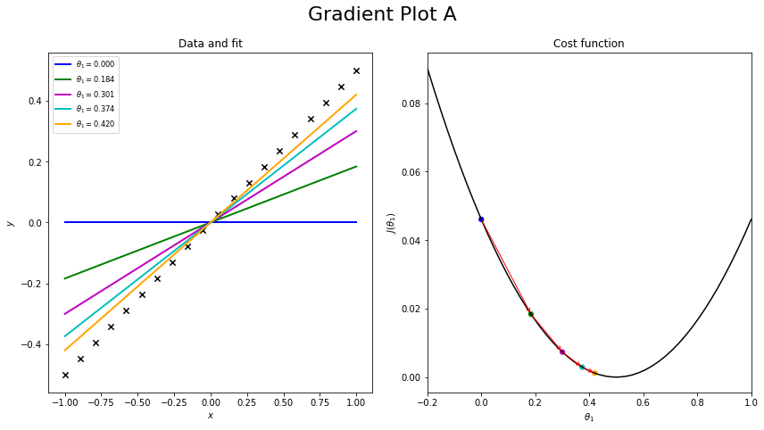


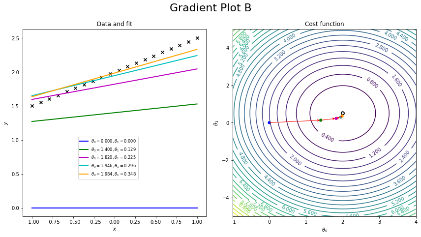


#### Forward-propagation


* Dense Layer

* Activation Layer

##### Forward-propagation


```python
from src.layers import dense_layer, sigmoid, tanh


def forward_propagation(
    input_x,
    weight_dict=None,
    print_ok=True,
    ):

    if weight_dict is None:
        weight_dict = {
            'w1': None,
            'b1': None,
            'w2': None,
            'b2': None,
        }
    
    w1 = weight_dict['w1']
    b1 = weight_dict['b1']
    w2 = weight_dict['w2']
    b2 = weight_dict['b2']

    
    #==== Essential ========================================================#

    ##### LAYER (Forward-propagation) #####

    # Input Layer
    input_layer = input_x

    # Hidden Layer
    hidden_layer_1, w1, b1 = dense_layer(
        input_layer,
        output_dim=4,
        weight=w1,
        bias=b1,
        seed=4,
        name='fc1_layer',
        print_ok=print_ok,
    )
    activated_1 = sigmoid(hidden_layer_1, print_ok=print_ok)

    # Output Layer
    hidden_layer_2, w2, b2 = dense_layer(
        hidden_layer_1,
        output_dim=2,
        weight=w2,
        bias=b2,
        seed=3,
        name='fc2_layer',
        print_ok=print_ok,
    )
    activated_2 = sigmoid(hidden_layer_2, print_ok=print_ok)
    
    #=======================================================================#
    
    
    if print_ok:
        print(f'\n= Input =\n{input_layer}')
        print(f'\n= 1 Layer =\n{hidden_layer_1}\n{activated_1}')
        print(f'\n= 2 Layer =\n{hidden_layer_2}')
        print(f'\n= Output =\n{activated_2}')


    weight_dict['w1'] = w1
    weight_dict['b1'] = b1
    weight_dict['l1'] = hidden_layer_1
    weight_dict['a1'] = activated_1
    
    
    weight_dict['w2'] = w2
    weight_dict['b2'] = b2
    weight_dict['l2'] = hidden_layer_2
    weight_dict['a2'] = activated_2

    return activated_2, weight_dict
```


```python
output, w_dict = forward_propagation(arr_x1)
```

    fc1_layer:	(1, 3) -> (1, 4)
    sigmoid
    ==========================================================================================================
    |  Raw                                              |   Activated                                        |
    |  (1, 4)                                           |   (1, 4)                                           |
    ==========================================================================================================
    |  [[2.22459999 1.6474     1.72249998 1.2728    ]]  |   [[0.90243695 0.83853934 0.84845057 0.78122169]]  |
    ==========================================================================================================
    fc2_layer:	(1, 4) -> (1, 2)
    sigmoid
    ==============================================================
    |  Raw                        |   Activated                  |
    |  (1, 2)                     |   (1, 2)                     |
    ==============================================================
    |  [[3.44976498 4.67717798]]  |   [[0.96922413 0.99078055]]  |
    ==============================================================
    
    = Input =
    [[0.93 0.65 0.03]]
    
    = 1 Layer =
    [[2.22459999 1.6474     1.72249998 1.2728    ]]
    [[0.90243695 0.83853934 0.84845057 0.78122169]]
    
    = 2 Layer =
    [[3.44976498 4.67717798]]
    
    = Output =
    [[0.96922413 0.99078055]]


#### Backpropagation


<br>
<div class="alert alert-block alert-warning">
<b>$\divideontimes$ 역전파(Backpropagation): </b> 

<br>
<br>
<font size='3'><center>마지막 Output과 실제 값과의 차이( $Loss$ )로 배운 경험을  
내부 $Weight$에 골고루 Feedback하는 과정.</center></font>
<br>
</div>  

<br>

<div class="alert alert-block alert-success">
<b>$\divideontimes$ Chain Rule: </b> 합성함수의 도함수에 대한 공식이다.
$$
z = g(f((x)) \space 일 \space 때 \\
\space \\
\frac{\partial z}{\partial x} = \frac{\partial z}{\partial y}\frac{\partial y}{\partial x}
$$

모델은 Layer들 간의 합성으로 이루어져 있다.  
즉, 모델 전체를 미분한 값은 Layer 각각 미분값의 곱과 같다.

$$
\frac{\partial z}{\partial w} = \frac{\partial z}{\partial y}\frac{\partial y}{\partial x}\frac{\partial x}{\partial w}
$$
<br>

</div>

<br>

<br>
<font size='3'>$$ \frac{\partial J}{\partial \theta} = \lim_{\varepsilon \to 0} \frac{J(\theta + \varepsilon) - J(\theta - \varepsilon)}{2 \varepsilon}$$</font>

$J$는 $Error$를, $\theta$는 $Weight$를 의미한다.  
즉,  <font size='3'>$\frac{\partial J}{\partial \theta}$</font>는 $Weight$ 변화량 대비 $Error$ 값의 변화량을 의미한다.

<font size='3'>
$$
J = MSE = \frac{1}{m}\sum\limits_{i=1}^m {(\hat{y} - y)^2}
$$

<br>


<div class="alert alert-block alert-success">
<b>$\divideontimes$ Derivative of Sigmoid </b>
<br>
<br>
비선형함수로 <b><i>'sigmoid'</i></b>가 자주 쓰이는 이유 중 하나는 도함수가 간단하기 때문이다.

<br>
<br>
\begin{array}{ll} \hline
Name
&
Formula
&
Derivative
\\ \hline
sigmoid
&
\sigma(x) = \dfrac{1}{1+e^{-x}}
&
\sigma(x)(1 - \sigma(x))
\\ \hline
tanh
&
2\sigma(2x) - 1
&
1-\tanh(x)^2
\\ \hline
\end{array}


```python
def d_sigmoid(y):
    return y * (1 - y)
```

##### Backpropagation (Scratch)


```python
from src.layers import d_sigmoid, d_tanh


def backward_propagation_scratch(
    input_x,
    input_y,
    weight_dict=None,
    learning_rate=5e-2,
    print_ok=True,
    ):
    
    m = input_dim = input_x.shape[-1]

    w1 = weight_dict['w1']
    b1 = weight_dict['b1']
    l1 = weight_dict['l1']
    a1 = weight_dict['a1']
    
    w2 = weight_dict['w2']
    b2 = weight_dict['b2']
    l2 = weight_dict['l2']
    a2 = weight_dict['a2']
    
    
    #==== Essential ========================================================#

    ##### LAYER (Back-propagation) #####

    # Calculate Gradients
    err = a2 - input_y
    d_a2 = err / d_sigmoid(a2)
    d_l2 = a2 - input_y
    d_b2 = 1./m * np.sum(d_l2.T, axis=1, keepdims=False)
    d_o2 = d_l2

    d_w2 = 1./m * (a1.T @ d_o2)
    d_a1 = d_o2 @ w2.T
    d_l1 = d_sigmoid(a1)
    d_b1 = 1./m * np.sum(d_l1.T, axis=1, keepdims=False)
    d_o1 = d_l1
    d_w1 = 1./m * (input_x.T @ d_o1)

    
    # Update
    new_w1 = w1 - (learning_rate * d_w1)
    new_b1 = b1 - (learning_rate * d_b1)
    new_w2 = w2 - (learning_rate * d_w2)
    new_b2 = b2 - (learning_rate * d_b2)

    #=======================================================================#

    
    if print_ok:
        print('\n\nResult: Backpropagation')
        aprint(w2, new_w2, name_list=['w2', 'new_w2'])
        aprint(b2, new_b2, name_list=['b2', 'new_b2'])
        aprint(w1, new_w1, name_list=['w1', 'new_w1'])
        aprint(b1, new_b1, name_list=['b1', 'new_b1'])

    w1 = new_w1
    b1 = new_b1
    w2 = new_w2
    b2 = new_b2


    gradient_dict = {
        'd_w1': d_w1,
        'd_b1': d_b1,
        'd_l1': d_l1,
        'd_a1': d_a1,
        
        'd_w2': d_w2,
        'd_b2': d_b2,
        'd_l2': d_l2,
        'd_a2': d_a2,
    }

    weight_dict['w1'] = new_w1
    weight_dict['b1'] = new_b1
    
    weight_dict['w2'] = new_w2
    weight_dict['b2'] = new_b2
    
    return gradient_dict, weight_dict
```


```python
output, w_dict = forward_propagation(arr_x1)
grad_dict, new_w_dict = backward_propagation_scratch(arr_x1, arr_y1, weight_dict=w_dict)
```

    fc1_layer:	(1, 3) -> (1, 4)
    sigmoid
    ==========================================================================================================
    |  Raw                                              |   Activated                                        |
    |  (1, 4)                                           |   (1, 4)                                           |
    ==========================================================================================================
    |  [[2.22459999 1.6474     1.72249998 1.2728    ]]  |   [[0.90243695 0.83853934 0.84845057 0.78122169]]  |
    ==========================================================================================================
    fc2_layer:	(1, 4) -> (1, 2)
    sigmoid
    ==============================================================
    |  Raw                        |   Activated                  |
    |  (1, 2)                     |   (1, 2)                     |
    ==============================================================
    |  [[3.44976498 4.67717798]]  |   [[0.96922413 0.99078055]]  |
    ==============================================================
    
    = Input =
    [[0.93 0.65 0.03]]
    
    = 1 Layer =
    [[2.22459999 1.6474     1.72249998 1.2728    ]]
    [[0.90243695 0.83853934 0.84845057 0.78122169]]
    
    = 2 Layer =
    [[3.44976498 4.67717798]]
    
    = Output =
    [[0.96922413 0.99078055]]
    
    
    Result: Backpropagation
    ==================================================
    |  w2             |   new_w2                     |
    |  (4, 2)         |   (4, 2)                     |
    ==================================================
    |  [[0.55 0.71]   |   [[0.54941005 0.7035208 ]   |
    |   [0.29 0.51]   |    [0.28945182 0.50397956]   |
    |   [0.89 0.9 ]   |    [0.88944534 0.8939084 ]   |
    |   [0.13 0.21]]  |    [0.12948929 0.20439108]]  |
    ==================================================
    ==============================================
    |  b2           |   new_b2                   |
    |  (2,)         |   (2,)                     |
    ==============================================
    |  [0.05 0.44]  |   [0.04934626 0.43282032]  |
    ==============================================
    ==================================================================================
    |  w1                       |   new_w1                                           |
    |  (3, 4)                   |   (3, 4)                                           |
    ==================================================================================
    |  [[0.97 0.55 0.97 0.71]   |   [[0.96681802 0.54673363 0.9667465  0.70666091]   |
    |   [0.7  0.22 0.98 0.01]   |    [0.69777604 0.21771705 0.97772605 0.00766623]   |
    |   [0.25 0.43 0.78 0.2 ]]  |    [0.24989736 0.42989463 0.77989505 0.19989229]]  |
    ==================================================================================
    ==============================================================================
    |  b1                     |   new_b1                                         |
    |  (4,)                   |   (4,)                                           |
    ==============================================================================
    |  [0.86 0.98 0.16 0.6 ]  |   [0.85657852 0.97648777 0.15650161 0.59640958]  |
    ==============================================================================


#### Optimization

<br>
<div class="alert alert-block alert-warning">
<b>$\divideontimes$ Optimizer: </b> <b>지름길을 잘 찾는 방법 </b>
<br>
<br>
<font size='3'><center><b> 눈앞의 이득(Local Minima)에 빠지지 않고, 최적의 답(Global Minima)을 잘 찾아야 한다!</b></center></font>

</div>
<br>
<br>

함수의 극대값 또는 극소값을 구하기 위해 현재 위치에서 함수값의 변화가 가장 큰 방향으로 이동한다.  
함수값의 변화가 가장 큰 방향을 구할 수만 있다면 다양한 문제에 똑같은 개념을 적용할 수 있다.


#### Exercise : Backprop + Optimizer

이제 다양한 Optimizer를 적용해서 Backpropagation을 수행해 보자.


```python
from src.optimizer import sgd, sgd_momentum, adagrad, rmsprop, adam


def backward_propagation(
    input_x,
    input_y,
    weight_dict=None,
    param_dict=None,
    loss_func=mean_squared_error,
    optimizer=sgd,
    print_ok=True,
    ):

    if param_dict is None:
        param_dict = {}
    learning_rate = param_dict['learning_rate']
    step_num = param_dict['step_num']
    
    m = input_dim = input_x.shape[-1]

    w1 = weight_dict['w1']
    b1 = weight_dict['b1']
    l1 = weight_dict['l1']
    a1 = weight_dict['a1']
    
    w2 = weight_dict['w2']
    b2 = weight_dict['b2']
    l2 = weight_dict['l2']
    a2 = weight_dict['a2']
    
    #==== Essential 1 ======================================================#

    ##### LAYER (Back-propagation) #####

    # Calculate Gradients
    err = loss_func(a2, input_y)
    d_a2 = err / d_sigmoid(a2)
    d_l2 = a2 - input_y
    d_b2 = 1./m * np.sum(d_l2.T, axis=1, keepdims=False)
    d_o2 = d_l2

    d_w2 = 1./m * (a1.T @ d_o2)
    d_a1 = d_o2 @ w2.T
    d_l1 = d_sigmoid(a1)
    d_b1 = 1./m * np.sum(d_l1.T, axis=1, keepdims=False)
    d_o1 = d_l1
    d_w1 = 1./m * (input_x.T @ d_o1)

    #=======================================================================#

    delta_dict = {
        'w2': d_w2,
        'b2': d_b2,
        'w1': d_w1,
        'b1': d_b1,
    }

    step_num += 1

    for w_name in delta_dict:
        param_dict[w_name] = {}
        param_dict[w_name]['learning_rate'] = learning_rate
        param_dict[w_name]['step_num'] = step_num


    #==== Essential 2 ======================================================#

    # Update
    new_w_list = []
    for w_name in delta_dict:
        w, dw = w_dict[w_name], delta_dict[w_name]

        new_w, param_dict[w_name] = optimizer(w, dw, param_dict=param_dict[w_name])
        new_w_list += [new_w]

    new_w2, new_b2, new_w1, new_b1 = new_w_list

    #=======================================================================#
    
    
    if print_ok:
        print(f"\n\nResult: Backpropagation {step_num}, Optimizer = '{optimizer.__name__}'")
        aprint(w2, new_w2, name_list=['w2', 'new_w2'])
        aprint(b2, new_b2, name_list=['b2', 'new_b2'])
        aprint(w1, new_w1, name_list=['w1', 'new_w1'])
        aprint(b1, new_b1, name_list=['b1', 'new_b1'])

    weight_dict['w1'] = new_w1
    weight_dict['b1'] = new_b1
    
    weight_dict['w2'] = new_w2
    weight_dict['b2'] = new_b2
    
    param_dict['step_num'] = step_num
    param_dict['learning_rate'] = learning_rate
    

    return weight_dict, param_dict
```

#### Exercise : Training


```python
#--------------------#

"""Parameter Setting.
"""

# OPTIMIZER = sgd
# OPTIMIZER = sgd_momentum
OPTIMIZER = adagrad
# OPTIMIZER = rmsprop
# OPTIMIZER = adam

MAX_STEP = 100
LEARNING_RATE = 0.005

#--------------------#


print_ok = False
p_dict = {}
p_dict['learning_rate'] = LEARNING_RATE
p_dict['step_num'] = 0
w_dict = None
output_list = []


#==== Essential ========================================================#

for _ in range(MAX_STEP):
    output, w_dict = forward_propagation(
        arr_x1,
        weight_dict=w_dict,
        print_ok=print_ok,
    )
    w_dict, p_dict = backward_propagation(
        arr_x1,
        arr_y1,
        loss_func=mean_squared_error,
        weight_dict=w_dict,
        param_dict=p_dict,
        optimizer=OPTIMIZER,
        print_ok=print_ok,
    )
    output_list += [output]
    
#=======================================================================#


    if _ % (MAX_STEP // 10) >= 9:
        print('Step_num :', p_dict['step_num'])
        aprint(
            output_list[0],
            output,
            arr_y1,
            name_list=['1st OUTPUT', 'LAST OUTPUT', 'GROUND TRUTH'],
            decimals=3,
        )
        print('')

last_output, _ = forward_propagation(
    arr_x1,
    weight_dict=w_dict,
    print_ok=False,
)
```

    Step_num : 10
    =============================================================
    |  1st OUTPUT       |   LAST OUTPUT      |   GROUND TRUTH   |
    |  (1, 2)           |   (1, 2)           |   (1, 2)         |
    =============================================================
    |  [[0.969 0.991]]  |   [[0.948 0.983]]  |   [[0.93 0.56]]  |
    =============================================================
    
    Step_num : 20
    =============================================================
    |  1st OUTPUT       |   LAST OUTPUT      |   GROUND TRUTH   |
    |  (1, 2)           |   (1, 2)           |   (1, 2)         |
    =============================================================
    |  [[0.969 0.991]]  |   [[0.927 0.969]]  |   [[0.93 0.56]]  |
    =============================================================
    
    Step_num : 30
    =============================================================
    |  1st OUTPUT       |   LAST OUTPUT      |   GROUND TRUTH   |
    |  (1, 2)           |   (1, 2)           |   (1, 2)         |
    =============================================================
    |  [[0.969 0.991]]  |   [[0.93  0.947]]  |   [[0.93 0.56]]  |
    =============================================================
    
    Step_num : 40
    =============================================================
    |  1st OUTPUT       |   LAST OUTPUT      |   GROUND TRUTH   |
    |  (1, 2)           |   (1, 2)           |   (1, 2)         |
    =============================================================
    |  [[0.969 0.991]]  |   [[0.93  0.913]]  |   [[0.93 0.56]]  |
    =============================================================
    
    Step_num : 50
    =============================================================
    |  1st OUTPUT       |   LAST OUTPUT      |   GROUND TRUTH   |
    |  (1, 2)           |   (1, 2)           |   (1, 2)         |
    =============================================================
    |  [[0.969 0.991]]  |   [[0.928 0.868]]  |   [[0.93 0.56]]  |
    =============================================================
    
    Step_num : 60
    =============================================================
    |  1st OUTPUT       |   LAST OUTPUT      |   GROUND TRUTH   |
    |  (1, 2)           |   (1, 2)           |   (1, 2)         |
    =============================================================
    |  [[0.969 0.991]]  |   [[0.926 0.813]]  |   [[0.93 0.56]]  |
    =============================================================
    
    Step_num : 70
    =============================================================
    |  1st OUTPUT       |   LAST OUTPUT      |   GROUND TRUTH   |
    |  (1, 2)           |   (1, 2)           |   (1, 2)         |
    =============================================================
    |  [[0.969 0.991]]  |   [[0.92  0.752]]  |   [[0.93 0.56]]  |
    =============================================================
    
    Step_num : 80
    =============================================================
    |  1st OUTPUT       |   LAST OUTPUT      |   GROUND TRUTH   |
    |  (1, 2)           |   (1, 2)           |   (1, 2)         |
    =============================================================
    |  [[0.969 0.991]]  |   [[0.909 0.689]]  |   [[0.93 0.56]]  |
    =============================================================
    
    Step_num : 90
    =============================================================
    |  1st OUTPUT       |   LAST OUTPUT      |   GROUND TRUTH   |
    |  (1, 2)           |   (1, 2)           |   (1, 2)         |
    =============================================================
    |  [[0.969 0.991]]  |   [[0.892 0.631]]  |   [[0.93 0.56]]  |
    =============================================================
    
    Step_num : 100
    =============================================================
    |  1st OUTPUT       |   LAST OUTPUT      |   GROUND TRUTH   |
    |  (1, 2)           |   (1, 2)           |   (1, 2)         |
    =============================================================
    |  [[0.969 0.991]]  |   [[0.866 0.582]]  |   [[0.93 0.56]]  |
    =============================================================
    


### MLP Summary


RNN으로 넘어가기 전에, MLP 작동 프로세스를 한번 더 확인해 보자.
<br>

<font size='4'> <b> $\cdot$ 계산 흐름 : MLP</b></font>


# References

https://wiseodd.github.io/techblog/2016/06/22/nn-optimization/  
https://towardsdatascience.com/illustrated-guide-to-lstms-and-gru-s-a-step-by-step-explanation-44e9eb85bf21
